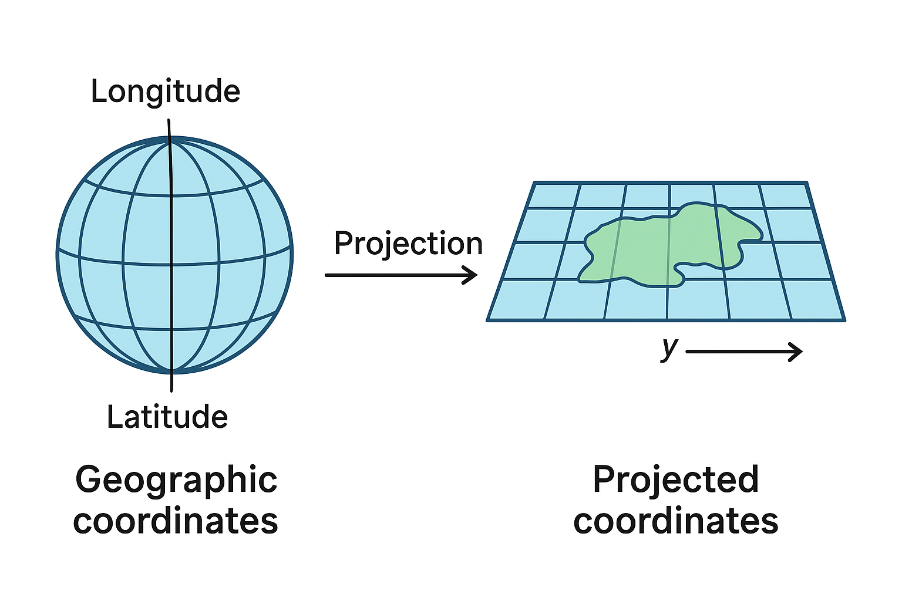
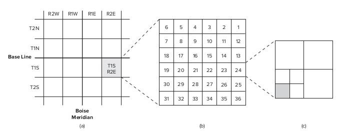

## 🔑 Inti Sari Materi: **Koordinat & Proyeksi Peta di GIS**

1. **Kenapa penting?**

   * Kalau kita gabungkan beberapa layer peta (misalnya jalan Idaho dan Montana), tapi sistem koordinatnya beda → hasilnya bisa **tidak nyambung**.
   * Supaya data **sejajar/selaras**, semua layer harus pakai **sistem koordinat yang sama**.

2. **Jenis sistem koordinat**

   * **Geografis (longitude & latitude)** → posisi asli di bumi, bentuk bola.
   * **Planar/Proyeksi (x, y)** → posisi di bidang datar (peta kertas/layar).

3. **Map Projection**

   * Proses “menghamparkan” bumi yang bulat ke bidang datar.
   * Hasilnya: peta bisa dipakai untuk analisis di komputer.

4. **Projection vs Reprojection**

   * **Projection** → ubah data dari koordinat geografis (lat/long) ke koordinat proyeksi (x,y).
   * **Reprojection** → ubah data dari satu sistem proyeksi ke sistem proyeksi lain.

5. **Kapan dilakukan?**

   * Biasanya di **awal proyek GIS** → supaya semua data (raster, vektor) berada pada sistem koordinat yang sama, baru kemudian dianalisis.

---

📌 **Ringkas banget:**
Dalam GIS, semua data peta harus **pakai sistem koordinat yang sama** → kalau beda, harus diproyeksikan ulang supaya layer bisa **tumpang tindih dengan benar**.


<p align="center">
  
</p>


---

## 🔑 Inti Sari **Geographic Coordinate System (GCS)**

1. **Apa itu GCS?**

   * Sistem koordinat untuk menunjukkan posisi di permukaan bumi.
   * Pakai **longitude (bujur)** dan **latitude (lintang)**.

2. **Longitude (Bujur)**

   * Garis vertikal (meridian).
   * Mengukur **timur–barat** dari *Prime Meridian* (Greenwich, 0°).
   * Nilai: 0° – 180° E (positif) dan 0° – 180° W (negatif).

3. **Latitude (Lintang)**

   * Garis horizontal (paralel).
   * Mengukur **utara–selatan** dari ekuator (0°).
   * Nilai: 0° – 90° N (positif) dan 0° – 90° S (negatif).

4. **Contoh koordinat:**

   * (120° W, 60° N) = 120° barat Greenwich, 60° utara ekuator.

5. **Format koordinat:**

   * Bisa ditulis dalam:

     * **DMS (Derajat, Menit, Detik)** → 45°52'30"
     * **DD (Desimal Derajat)** → 45.875°
     * **Radian** → biasanya dipakai komputer.

6. **Bentuk bumi bukan bola sempurna.**

   * Bumi lebih lebar di ekuator daripada di kutub.
   * Bentuk yang lebih tepat disebut **ellipsoid (oblate spheroid)**.
   * Ukuran ellipsoid diukur dengan parameter **flattening (f)** = (a – b) / a,
     di mana **a = sumbu ekuator (besar)**, **b = sumbu kutub (kecil)**.

---

📌 **Ringkas banget:**

* GCS = sistem koordinat bumi pakai bujur & lintang.
* Longitude = timur–barat dari Greenwich, Latitude = utara–selatan dari ekuator.
* Bumi bukan bola sempurna → pakai model ellipsoid untuk hitungan yang lebih akurat.

---

Baik, saya sederhanakan dan ambil inti sarinya ya 👍

---

## 🔑 Inti Sari tentang **Datum dalam GIS**

1. **Apa itu Datum?**

   * Datum = model matematis Bumi yang dipakai sebagai acuan untuk menghitung koordinat geografis (horizontal) atau ketinggian (vertical).
   * Jadi, kalau mau tahu posisi (longitude–latitude) atau elevasi, kita butuh datum sebagai “patokan”.

2. **Hubungan dengan Ellipsoid**

   * Datum selalu terkait dengan **ellipsoid** (bentuk bola pepat Bumi).
   * Setiap datum punya titik awal/origin dan cara berbeda dalam menyesuaikan ellipsoid dengan bentuk Bumi sebenarnya.

3. **Contoh Penting: NAD27 vs NAD83**

   * **NAD27 (1927)** → pakai *Clarke 1866 ellipsoid*, berbasis pengukuran darat, pusatnya di Kansas.
   * **NAD83 (1983)** → pakai *GRS80 ellipsoid*, berbasis satelit (lebih akurat), pusatnya di tengah massa Bumi (*geocentric*).
   * NAD83 lebih modern dan akurat dibanding NAD27.

4. **Masalah: Datum Shift**

   * Kalau data peta pakai datum berbeda (misalnya NAD27 vs NAD83), posisi titik bisa **bergeser puluhan hingga ratusan meter**.
   * Contoh: di Washington, bisa bergeser ~101 meter!
   * Solusi → lakukan **datum transformation** (pakai software GIS, misalnya NADCON) supaya layer peta bisa sejajar.

5. **Update NAD83**

   * NAD83 sudah diperbarui beberapa kali dengan teknologi GPS → HARN, CORS, NSRS2007, hingga NAD83(2011).
   * Setiap pembaruan membuat posisi koordinat semakin akurat (selisih bisa dari 1 meter jadi hanya beberapa cm).

6. **Kenapa Penting?**

   * Akurasi datum sangat penting untuk:

     * Batas tanah (pertanahan).
     * Pembangunan jalan, pipa, jaringan listrik.
     * Analisis spasial presisi tinggi.
   * Buat pengguna GIS, yang paling penting adalah **jangan mencampur layer dengan datum berbeda tanpa transformasi**.

---

📌 **Ringkasnya:**
Datum itu standar acuan untuk koordinat. NAD27 lebih lama dan kurang akurat, NAD83 lebih baru dan presisi. Kalau peta dari berbagai sumber punya datum berbeda → harus diubah dulu supaya pas (tidak meleset).

---

Pertanyaan bagus Pak 👌

### 🔧 Tools untuk bekerja dengan **Datum & Transformasi Koordinat**

1. **QGIS** ✅

   * Bisa banget, QGIS sudah punya **CRS (Coordinate Reference System)** lengkap.
   * Ada pilihan ribuan datum & proyeksi (misalnya WGS84, NAD83, dll).
   * QGIS otomatis bisa **reproject layer** (ubah datum/proyeksi) → tinggal klik kanan layer → **Export → Save Features As → pilih CRS baru**.
   * Juga ada fitur **On-the-fly Reprojection** → jadi kalau layer berbeda datum, QGIS bisa menyesuaikan tampilannya.

2. **ArcGIS Pro**

   * Komersial (berbayar), tapi juga sangat kuat untuk datum transformation.
   * Banyak dipakai di instansi pemerintah & industri.

3. **PROJ (library open-source)**

   * Ini mesin perhitungan proyeksi & datum yang dipakai QGIS, PostGIS, GDAL.
   * Bisa dipakai langsung via command line.

4. **PostGIS (untuk database spasial PostgreSQL)**

   * Bisa menyimpan data dengan CRS berbeda dan transformasi antar datum pakai fungsi `ST_Transform()`.
   * Sangat berguna kalau datanya besar (ribuan/milion records).

5. **GDAL/OGR**

   * Tools command line (dan library Python) untuk konversi data GIS.
   * Contoh: `ogr2ogr -t_srs EPSG:4326 output.shp input.shp` untuk transformasi datum.

---

### 📌 Mana yang terbaik?

* **Untuk penelitian dan praktikum** → **QGIS** sudah lebih dari cukup (gratis, user-friendly, banyak tutorial).
* **Untuk skala industri / big data** → bisa kombinasikan **PostGIS + QGIS**.

---

👉 Jadi, jawabannya: **Ya, QGIS bisa dan sangat bagus** untuk bekerja dengan datum sekarang.


Baik, saya sederhanakan lagi isi dari bagian **2.1.4 WGS84** dan **2.2 Map Projections** supaya mudah dipahami 👇

---

## 🔑 Inti Sari

### 1. **WGS84 (World Geodetic System 1984)**

* **Apa itu?**
  Sistem referensi global yang dipakai untuk GPS.
* **Kenapa penting?**
  Semua satelit GPS dan perhitungan di perangkat GPS berbasis **WGS84**.
* **Sejarah:**

  * Dibuat tahun 1987 dengan data satelit Doppler.
  * Awalnya sama dengan NAD83 (di Amerika Utara).
  * Setelah itu diperbarui beberapa kali dengan data GPS lebih akurat → menghasilkan beberapa versi (misalnya WGS84(G873), WGS84(G1150), dst).
  * Versi baru selalu diselaraskan dengan **ITRF (International Terrestrial Reference Frame)**.

➡ **Kesimpulan:** Kalau kita ambil data dari GPS (misalnya koordinat pakai HP), otomatis datanya pakai **WGS84**.

---

### 2. **Map Projection (Proyeksi Peta)**

* **Masalah:**
  Bumi bentuknya bulat/ellipsoid → susah dipindahkan langsung ke peta datar.

* **Solusi:**
  Gunakan **proyeksi peta**, yaitu cara “mentransformasikan” koordinat di bumi ke bidang datar.

* **Kelebihan proyeksi:**

  * Bisa bikin peta 2D (kertas atau digital).
  * Bisa pakai koordinat **x, y (plane coordinates)** yang lebih mudah untuk perhitungan.

* **Tapi ada konsekuensi:**

  * Setiap proyeksi pasti ada **distorsi** (bentuk, luas, jarak, atau arah tidak bisa semua akurat sekaligus).
  * Karena itu, dibuat ratusan jenis proyeksi untuk tujuan berbeda (misalnya peta dunia vs peta kota).

➡ **Kesimpulan:** Tidak ada proyeksi peta yang sempurna. Pilih proyeksi sesuai kebutuhan (misalnya butuh akurasi luas, bentuk, atau jarak).

---

### 3. **Mengukur Jarak di Bumi**

* Kalau pakai koordinat datar (x, y) → bisa langsung pakai rumus jarak Euclidean.
* Kalau pakai koordinat geografis (latitude–longitude) → harus pakai rumus **geodesic distance**, karena bumi bulat dan garis bujur menyempit di kutub.
* **Trik cepat:** 1 derajat di garis khatulistiwa ≈ 111,32 km.

---

## 📌 Ringkas banget:

* **WGS84** = standar global untuk GPS.
* **Proyeksi peta** = cara memindahkan bumi bulat ke peta datar → pasti ada distorsi.
* **Pilih proyeksi** sesuai tujuan (jarak, luas, bentuk).

---

Oke, saya bantu sederhanakan penjelasan panjang di atas biar lebih gampang dipahami 👍

---

## 📌 Inti Sari: **Jenis & Parameter Proyeksi Peta**

### 1. **Jenis Proyeksi Berdasarkan Sifat yang Dipertahankan**

Proyeksi peta tidak bisa menjaga semua hal (bentuk, luas, jarak, arah) sekaligus. Karena itu, proyeksi dibagi jadi 4:

1. **Conformal** → bentuk & sudut lokal tetap benar (cocok untuk navigasi).
2. **Equal Area (Equivalent)** → luas tetap benar (cocok untuk peta populasi/tematik).
3. **Equidistant** → jarak benar pada garis tertentu (cocok untuk radius jarak dari satu titik).
4. **Azimuthal (True Direction)** → arah benar dari/t ke pusat peta (cocok untuk peta penerbangan).

⚠️ Catatan: *Conformal* dan *Equal Area* tidak bisa digabung, tapi yang lain bisa dipadukan.

---

### 2. **Jenis Proyeksi Berdasarkan Permukaan Proyeksi**

Bayangkan bumi ditempeli benda geometri (silinder, kerucut, atau bidang datar), lalu diproyeksikan:

* **Cylindrical (silinder)** → contoh: Mercator.
* **Conic (kerucut)** → contoh: Albers Conic.
* **Azimuthal (bidang datar/plane)** → contoh: Azimuthal Equidistant.

---

### 3. **Konsep Case & Aspect**

* **Case (cara menempel permukaan ke bumi):**

  * **Simple case (tangent)** → hanya 1 garis singgung.
  * **Secant case (memotong)** → ada 2 garis singgung → biasanya distorsi lebih kecil.

* **Aspect (posisi benda terhadap bumi):**

  * **Polar** → ditempel di kutub.
  * **Equatorial** → ditempel di khatulistiwa.
  * **Oblique** → ditempel di posisi miring (antara kutub & khatulistiwa).

---

### 4. **Parameter Proyeksi**

Beberapa istilah penting:

* **Standard line** → garis singgung, tempat distorsi = 0 (paling akurat).

  * Disebut *standard parallel* (kalau sejajar lintang).
  * Disebut *standard meridian* (kalau sejajar bujur).
* **Central line** → titik pusat peta (beda dengan standard line).
* **Scale factor** → ukuran distorsi.

  * Di standard line = 1 (benar).
  * Jauh dari situ → bisa lebih kecil atau lebih besar.
* **False easting / false northing** → dipakai supaya koordinat selalu positif (hindari angka negatif).

---

## 🎯 Contoh Praktis

* **Peta Dunia Populasi** → pakai *Equal Area* (biar luas tiap negara benar).
* **Jangkauan Tower Sinyal** → pakai *Equidistant*.
* **Navigasi Kapal/Pesawat** → pakai *Conformal* atau *Azimuthal*.

---

👉 Jadi, intinya **pilih proyeksi sesuai kebutuhan**: mau akurat bentuk, luas, jarak, atau arah.
Tidak ada proyeksi yang bisa menjaga semuanya sekaligus.

---


### 🗺️ Apa sih maksudnya "parameter proyeksi peta"?

Kalau kita mau menggambar bumi yang bulat ke peta yang datar, kita butuh aturan/parameter biar hasilnya tetap bisa dipakai. Parameter ini ibarat **setting-an** waktu bikin peta.

---

### 🔑 Parameter utamanya:

1. **Standard line (garis standar)**

   * Bayangkan globe ditempelkan ke kertas di satu garis.
   * Di garis itu, peta **paling akurat** (tidak ada distorsi).
   * Bisa horizontal (lintang → disebut *standard parallel*) atau vertikal (bujur → disebut *standard meridian*).

2. **Central line (garis tengah)**

   * Ini **pusat peta**.
   * Belum tentu sama dengan standard line.
   * Contoh: proyeksi Transverse Mercator punya **garis tengah** (central meridian) + 2 garis standar di sampingnya.

3. **Scale (skala)**

   * Perbandingan jarak peta dengan jarak aslinya.
   * Karena bumi bulat → begitu dipetakan ke datar, skala bisa **berubah-ubah**.
   * Kalau di garis standar: skala = pas (1:1).
   * Kalau jauh dari garis standar: skala bisa lebih besar/kecil (ada distorsi).

4. **False origin (asal palsu)**

   * Biar gampang, semua koordinat di peta diusahakan **positif** (tidak ada minus).
   * Caranya: geser titik awal koordinat pakai **false easting (X)** dan **false northing (Y)**.
   * Jadi semua titik ada di kuadran kanan atas (positif-positif).

---

### 🎯 Inti mudahnya:

* Peta datar itu hasil “trik” memindahkan bumi bulat.
* **Standard line** = area paling akurat.
* **Central line** = pusat peta.
* **Scale** = ukuran distorsi (makin jauh makin salah).
* **False origin** = geser koordinat biar semua positif.

---

Betul sekali 👍

Materi tentang **datum, proyeksi, koordinat, elevasi** itu masih masuk ke **ranah teori dasar geospasial**. Tujuannya supaya kita paham:

* Kenapa data dari sumber berbeda (misalnya Google Maps, GPS, atau peta pemerintah) bisa **tidak sejajar**.
* Bagaimana cara memilih **datum** (misalnya WGS84, EGM96, dll) sesuai kebutuhan.
* Apa beda antara **elevasi geoid** (tinggi dari permukaan laut) dan **elevasi elipsoid** (tinggi dari model bumi ellipsoid).
* Bagaimana proyeksi mempengaruhi bentuk peta (misalnya Mercator, UTM, dll).

---

🔧 **Implementasi praktisnya** memang sudah *tools-based* dan tinggal pakai:

* **QGIS / ArcGIS**: kita tinggal pilih CRS (Coordinate Reference System), misalnya EPSG:4326 (WGS84) atau EPSG:32750 (UTM zone 50S).
* **GPS & Drone Mapping**: biasanya default pakai WGS84, lalu software pemroses (misalnya Pix4D, Agisoft, atau QGIS) bisa dikonversi ke datum lain.
* **DEM (Digital Elevation Model)**: data seperti SRTM atau Copernicus biasanya sudah punya definisi datum, tinggal kita sesuaikan di software.

---

👉 Jadi, **teori ini penting supaya kita tidak bingung saat data dari berbagai sumber tidak nyambung posisinya**.
Misalnya: data GPS (WGS84) bisa bergeser beberapa meter dibanding peta dari BPN (DGN95 / ITRF).

Oke, saya kasih **contoh nyata sederhana** di QGIS ya, biar kelihatan kenapa teori datum itu penting 👇

---

## 📌 Kasus: Data GPS vs Peta BPN

1. **Data GPS**

   * Misalnya kita ambil titik koordinat pakai GPS HP.
   * Hasil koordinat biasanya dalam sistem **WGS84 (EPSG:4326)**.

   Contoh titik (GPS):

   ```
   Latitude : -1.234567
   Longitude: 116.987654
   ```

2. **Peta BPN (Badan Pertanahan Nasional)**

   * Banyak peta pertanahan Indonesia masih pakai datum **DGN95 / ITRF**, yang sedikit berbeda dari WGS84.
   * Koordinat untuk lokasi yang sama bisa bergeser **±1–3 meter**.

---

## 🗺 Implementasi di QGIS

👉 **Langkah uji coba:**

1. Buka QGIS → tambahkan **basemap Google Maps** (sudah WGS84).
2. Tambahkan titik koordinat GPS tadi (EPSG:4326).
3. Tambahkan shapefile dari BPN (biasanya EPSG:23845 / UTM DGN95).
4. Lihat hasilnya → titik GPS tidak pas dengan peta BPN, ada pergeseran.

---

## 📊 Visualisasi Perbandingan (sederhana)

```
+-------------------------------------+
|                                     |
|  [Peta BPN (DGN95)]                 |
|       _________                     |
|      |         |                    |
|      |   Lahan |                    |
|      |_________|                    |
|         x                            |
|        (GPS titik WGS84)            |
|                                     |
+-------------------------------------+
```

👉 Terlihat ada **perbedaan posisi** antara titik GPS dan peta BPN.
Kalau tidak paham teori datum, kita bisa mengira data “salah”, padahal cuma beda referensi.

---

## 🔧 Solusi

* Di QGIS → lakukan **Reproject Layer** atau gunakan **On the Fly CRS Transformation**.
* Misalnya, konversi titik GPS (EPSG:4326) ke EPSG:23845 agar sesuai dengan peta BPN.
* Setelah itu titik GPS akan sejajar dengan batas lahan di peta.

---

Baik, saya bikinkan **contoh step by step** (pakai data dummy sederhana) biar kamu bisa bayangkan implementasi teori datum langsung di **QGIS** 👇

---

# 📘 Contoh Implementasi Datum di QGIS

## 1. Siapkan Data

* **Data GPS**: titik koordinat hasil HP/GPS (`WGS84 / EPSG:4326`).
  Contoh: `Lat -1.234567, Lon 116.987654`.
* **Data Peta BPN**: shapefile bidang tanah (biasanya `UTM / DGN95`).
  Contoh: EPSG:23845 (UTM Zone 50S, DGN95).

---

## 2. Buka QGIS

* Jalankan QGIS.
* Buat proyek baru dengan **CRS: EPSG:4326 (WGS84)**.

---

## 3. Tambahkan Basemap

* Install plugin **QuickMapServices** → pilih **Google Satellite** atau **OpenStreetMap**.
* Basemap ini otomatis pakai `EPSG:4326`.

---

## 4. Tambahkan Data GPS

* Buat layer titik (`Add Layer → Add Delimited Text Layer`).
* Masukkan koordinat GPS (EPSG:4326).
* Titik muncul di peta, sejajar dengan basemap.

---

## 5. Tambahkan Data Shapefile BPN

* Import shapefile bidang tanah dari BPN.
* Biasanya sistem koordinatnya **EPSG:23845 (DGN95 UTM 50S)**.
* QGIS akan otomatis melakukan **on-the-fly CRS transformation** → tapi sering ada geser beberapa meter.

---

## 6. Lihat Perbedaan

* Zoom ke lokasi → titik GPS vs peta bidang tanah terlihat **tidak persis overlap**.
* Contoh ilustrasi sederhana:

```
[ Shapefile BPN (DGN95) ]
   +------------------+
   |   Bidang Tanah   |
   |        _______   |
   |       |       |  |
   |       |_______|  |
   |                  |
   +------------------+
          x
         (GPS titik WGS84)
```

---

## 7. Reproject Layer

* Klik kanan **Data GPS Layer → Export → Save Features As…**.
* Pilih CRS tujuan = **EPSG:23845 (DGN95)**.
* Simpan → hasil titik baru akan sejajar dengan shapefile BPN.

---

## 8. Hasil Akhir

* Sekarang **titik GPS** sudah pas menempel di bidang tanah BPN.
* Data sudah konsisten → bisa lanjut ke digitasi area 3 hektar, buat polygon, lalu simpan ke **GeoJSON**.

---

🔑 **Kesimpulan:**

* Teori datum menjelaskan **kenapa data geser**.
* Implementasi di QGIS cukup dengan **Reproject Layer**.
* Setelah itu data siap dipakai untuk analisis & visualisasi.

---

Baik, saya sederhanakan dan ambil **inti sari** dari teks tersebut supaya lebih mudah dipahami:

---

📌 **Inti Materi: Peta Proyeksi yang Sering Digunakan di GIS**

1. **Banyak jenis proyeksi peta** yang digunakan, tapi yang populer untuk keperluan umum (misalnya di majalah atau atlas) tidak selalu cocok untuk **GIS**.

   * Contoh: **Proyeksi Robinson** bagus untuk peta dunia karena indah, tapi kurang tepat untuk analisis GIS.

2. **GIS lebih sering menggunakan proyeksi dengan sifat khusus**, terutama **konformal** (preserve local shape & angle → bentuk dan sudut lokal tetap benar).

   * Penting agar **peta bisa disambung** dengan baik (misalnya seri peta USGS).

3. **Transverse Mercator Projection (Gauss-Krüger)**

   * Jenis proyeksi silinder (turunan dari Mercator).
   * Bedanya dengan Mercator biasa:

     * **Mercator standar** → pakai garis lintang (equator) sebagai acuan.
     * **Transverse Mercator** → pakai garis bujur (central meridian) sebagai acuan.
   * Keduanya **konformal** (bentuk lokal terjaga).
   * Jadi dasar untuk banyak sistem koordinat (contohnya UTM).
   * Butuh parameter khusus untuk mendefinisikan:

     * skala di meridian tengah,
     * bujur pusat,
     * lintang asal,
     * false easting,
     * false northing.

---

👉 **Kesimpulan mudah:**

* Peta di GIS tidak bisa sembarangan pakai proyeksi, biasanya dipilih yang **konformal** agar bentuk dan sudut tetap benar.
* **Transverse Mercator** adalah proyeksi yang sangat penting karena jadi dasar sistem koordinat modern seperti **UTM**.

---

Baik, saya sederhanakan isi bagian ini supaya mudah dipahami dengan inti sarinya 👇

---

📌 **Inti Materi: Proyeksi Conic (Kerucut) yang Umum di GIS**

1. **Lambert Conformal Conic**

   * Cocok untuk wilayah **lintang menengah** (midlatitude) yang bentuknya **lebih lebar timur-barat** daripada utara-selatan.
     👉 Contoh: Amerika Serikat, Montana.
   * Digunakan USGS untuk peta topografi sejak 1957.
   * **Sifat:** *Conformal* → bentuk & sudut lokal terjaga.
   * Parameter: dua paralel standar, meridian tengah, lintang asal, false easting, false northing.

2. **Albers Equal-Area Conic**

   * Hampir sama dengan Lambert (pakai parameter yang sama).
   * **Perbedaan utama:**

     * **Albers:** menjaga *luas area* (equal-area).
     * **Lambert:** menjaga *bentuk & sudut* (conformal).
   * Dipakai untuk **data tutupan lahan nasional** di Amerika Serikat.

3. **Equidistant Conic (Simple Conic)**

   * Juga mirip Lambert.
   * **Sifat:** menjaga **jarak** di sepanjang meridian dan satu atau dua paralel standar.
   * Parameter sama dengan Lambert.

---

👉 **Kesimpulan mudah:**

* **Semua proyeksi ini berbasis kerucut (conic).**
* Pilihannya tergantung kebutuhan:

  * **Lambert Conformal Conic** → kalau ingin bentuk/sudut tetap benar.
  * **Albers Equal-Area Conic** → kalau ingin luas area tetap benar.
  * **Equidistant Conic** → kalau ingin jarak tertentu tetap benar.

---

Oke, saya sederhanakan bagian **Web Mercator** ini supaya mudah dipahami 👇

---

📌 **Inti Materi: Web Mercator Projection**

1. **Apa itu Web Mercator?**

   * Proyeksi peta modern, populer sejak Google Maps (2005).
   * Dipakai oleh **Google Maps, Bing Maps, MapQuest, ArcGIS Online** → jadi standar untuk peta online.
   * Dasarnya dari proyeksi **Mercator**, tapi dibuat lebih sederhana dengan menganggap bumi seperti **bola (sphere)**, bukan elipsoid.

2. **Kelebihan:**

   * Perhitungan lebih mudah (cepat untuk web).
   * *Conformal* → bentuk & sudut lokal tetap benar (jadi peta terlihat “rapi” untuk navigasi).
   * Utara selalu di atas peta → konsisten dengan peta digital.

3. **Kekurangan:**

   * **Distorsi area & jarak**, terutama di wilayah lintang tinggi (misalnya dekat kutub → Greenland tampak jauh lebih besar dari aslinya).

4. **Solusi di GIS:**

   * GIS punya alat untuk **reproject** (ubah proyeksi) dari Web Mercator ke proyeksi lain yang lebih akurat sesuai kebutuhan.

---

👉 **Kesimpulan mudah:**

* **Web Mercator = proyeksi standar untuk peta online.**
* Kelebihannya cocok untuk tampilan visual & navigasi.
* Kekurangannya tidak cocok kalau butuh ukuran/luas yang benar (misalnya riset lahan, pertanian, atau lingkungan).

---

Oke, saya ringkas dan sederhanakan bagian **Projected Coordinate Systems (PCS)** ini supaya lebih mudah dipahami 👇

---

## 📌 Inti Materi: **Projected Coordinate Systems (PCS)**

1. **Apa itu PCS?**

   * PCS = sistem koordinat yang dibuat dari **map projection** (hasil "meratakan" bumi ke bidang datar).
   * Jadi, proyeksi peta (contoh: Lambert Conformal Conic) bisa dipakai langsung sebagai sistem koordinat.

2. **Kapan digunakan?**

   * Dipakai untuk **pemetaan skala besar** (misalnya 1:24.000) → detail tinggi, cocok untuk keperluan teknis (jalan, bangunan, batas tanah).
   * Fokusnya: **akurasi posisi** suatu fitur dibandingkan fitur lain.

3. **Ciri penting:**

   * PCS biasanya **dibagi jadi beberapa zona** agar akurat (misalnya UTM terbagi dalam zona per 6° bujur).
   * PCS didefinisikan oleh:

     * Parameter proyeksi peta (misalnya skala, garis tengah, dll).
     * Parameter sistem koordinat geografis (datum, seperti WGS84).

4. **Skala peta:**

   * **Map scale** = perbandingan jarak di peta dengan jarak di bumi.

     * Contoh: 1:24.000 → 1 cm di peta = 240 m di bumi.
   * Perlu dibedakan dengan **spatial scale** (skala ruang), yaitu luas area yang dicakup.

5. **Contoh PCS yang umum (di AS):**

   * **UTM (Universal Transverse Mercator)** → global, dibagi 60 zona.
   * **UPS (Universal Polar Stereographic)** → untuk daerah kutub.
   * **SPC (State Plane Coordinate)** → khusus tiap negara bagian di AS.
   * **PLSS (Public Land Survey System)** → bukan PCS, tapi sistem pembagian tanah.

---

👉 **Kesimpulan mudah:**

* **PCS = sistem koordinat datar hasil proyeksi peta, dipakai untuk pemetaan detail & akurat.**
* Selalu ada kompromi → PCS didesain agar cocok untuk wilayah tertentu dengan cara membagi menjadi zona.
* Skala besar (misal 1:24.000) = detail tinggi, cocok untuk analisis teknis.

---

Oke, saya sederhanakan dan ambil inti sari dari **2.4.1 Universal Transverse Mercator (UTM) Grid System** 👇

---

## 📌 Inti Materi: Universal Transverse Mercator (UTM)

1. **Apa itu UTM?**

   * Sistem koordinat **global** yang membagi bumi menjadi **60 zona**.
   * Tiap zona = **6° bujur** lebar, dari 180° Bujur Barat ke arah timur.
   * Zona diberi **nomor + huruf** (contoh: **UTM Zone 10N** = bujur 126°W–120°W di belahan utara).

2. **Dasar Proyeksi:**

   * Tiap zona diproyeksikan dengan **Transverse Mercator secant case**.
   * **Skala di central meridian = 0,9996** (sedikit dikompresi supaya lebih akurat).
   * Dua garis standar = ±180 km dari central meridian.

3. **Akurasi:**

   * Desain UTM memastikan akurasi **1:2500** (jarak 2500 m di lapangan → maksimal meleset 1 m di peta).

4. **False Origin (titik nol palsu):**

   * Supaya koordinat selalu **positif**.
   * **Belahan Utara**: dihitung dari ekuator (y=0) dan 500.000 m barat dari central meridian (x=500.000 m).
   * **Belahan Selatan**: dihitung dari 10.000.000 m selatan ekuator (y=10.000.000) dan 500.000 m barat central meridian (x=500.000 m).

5. **Koordinat besar → X-shift / Y-shift:**

   * Karena angka koordinat bisa sangat besar (jutaan), sering dipakai **x-shift & y-shift** agar lebih kecil.
   * Contoh: koordinat asli (500.000, 5.177.164) → setelah shift jadi (0, 7164).
   * **Catatan:** shift ini harus selalu disimpan di **metadata**.

---

👉 **Kesimpulan mudah:**

* **UTM = sistem grid global berbasis Transverse Mercator**.
* Membagi bumi jadi 60 zona → tiap zona 6°.
* Punya false origin supaya semua koordinat positif.
* Akurat untuk pemetaan detail, tapi harus tahu zona mana yang dipakai.

---

Oke, saya sederhanakan dan ambil inti sarinya dari **2.4.2 Universal Polar Stereographic (UPS) Grid System** dan **2.4.3 State Plane Coordinate (SPC) System** 👇

---

## 📌 1 Universal Polar Stereographic (UPS)

* **Fokus:** digunakan khusus untuk **daerah kutub** (dekat utara & selatan).
* **Dasar proyeksi:** stereographic projection (peta diproyeksikan dari titik kutub).
* **Struktur:** dibagi dalam kotak grid **100 km × 100 km** seperti UTM.
* **Fungsi:** melengkapi UTM supaya seluruh permukaan bumi bisa dipetakan (karena UTM hanya sampai 80°S – 84°N).

👉 **Intinya:** UPS = sistem koordinat untuk kutub, sama prinsipnya dengan UTM tapi khusus area ekstrem utara & selatan.

---

## 📌 2 State Plane Coordinate (SPC)

* **Fokus:** hanya digunakan di **Amerika Serikat**.
* **Tujuan awal:** mencatat lokasi monumen hasil survei tanah secara **presisi tinggi**.
* **Akurasi:** harus lebih baik dari **1:10.000** (jarak 10.000 m → meleset max 1 m).
* **Zona:**

  * Satu negara bagian bisa punya **beberapa zona** tergantung bentuknya.
  * **Zona memanjang utara-selatan** → pakai *Transverse Mercator*.
  * **Zona memanjang timur-barat** → pakai *Lambert Conformal Conic*.
  * Ada juga yang pakai *Oblique Mercator* (contoh: Alaska).
* **False Origin:** tiap zona punya titik nol palsu supaya koordinat tetap positif.
* **Versi:**

  * **SPC27** (pakai datum NAD27, satuan feet).
  * **SPC83** (pakai datum NAD83, satuan meter).
* **Masalah zona banyak:** jika studi mencakup beberapa zona → data harus dikonversi ke satu zona → akurasi bisa berkurang.
* **Solusi:** beberapa negara bagian bikin **sistem koordinat tunggal** (misalnya Idaho, Montana, Nebraska).

👉 **Intinya:** SPC = sistem koordinat khusus AS, dibuat sangat akurat per negara bagian. Tapi ribet karena banyak zona, jadi sebagian negara bagian bikin sistem tunggal sendiri.

---

📌 **Ringkasan gampang:**

* **UTM → global (84°N – 80°S).**
* **UPS → kutub.**
* **SPC → Amerika Serikat (skala detail, akurat banget).**

---

Oke, saya sederhanakan isi dari **2.4.4 The Public Land Survey System (PLSS)** supaya lebih mudah dipahami:

---

### Inti Sari:

* **PLSS** adalah sistem pembagian tanah di Amerika (terutama wilayah tengah dan barat).
* Tanah dibagi menjadi **kotak 6 × 6 mil** yang disebut **township**.
* Satu township dibagi lagi menjadi **36 kotak kecil (sections)**, masing-masing berukuran **1 × 1 mil (640 acre)**.
* Section masih bisa dibagi lebih kecil lagi, misalnya jadi 40 acre, dengan penamaan posisi (misalnya **SW 1/4 dari SW 1/4 Section 5, T1S, R2E**).
* **T1S, R2E** artinya:

  * **T1S** → Township 1 unit ke arah **selatan** dari garis dasar (base line).
  * **R2E** → 2 unit ke arah **timur** dari meridian utama (misalnya Meridian Boise).
* Data PLSS digunakan oleh **Bureau of Land Management (BLM)** untuk membuat database (GCDB) berisi koordinat dan info batas tanah.

---

### Sederhananya:

PLSS adalah **cara membagi tanah menjadi kotak-kotak teratur** supaya bisa dicatat, dijual, atau dikelola dengan jelas. Mulai dari **kotak besar (township)** → dibagi jadi **kotak sedang (section)** → bisa dipecah lagi jadi **kotak kecil (acre)**.

---

<p align="center">
  
</p>


Baik, saya ringkas dan sederhanakan inti dari **2.5 Options for Coordinate Systems in GIS**:

---

### 🔑 **Inti Sari**

Dalam GIS, kita sering perlu mengatur sistem koordinat. Ada 3 hal penting yang biasanya dilakukan:

1. **Menentukan sistem koordinat** (define).
2. **Mengubah koordinat geografis ke proyeksi** (project).
3. **Mengubah dari satu proyeksi ke proyeksi lain** (reproject).

Karena banyak sekali pilihan sistem koordinat, GIS menyediakan beberapa cara untuk mempermudah:

---

### 📂 **1. Projection File (.prj)**

* File teks kecil yang menyimpan informasi sistem koordinat sebuah data (misalnya proyeksi, datum, unit, dll).
* Gunanya:

  * Menjelaskan sistem koordinat dataset.
  * Bisa dipakai untuk memproyeksikan ulang dataset lain.
  * Bisa dibagikan ke dataset lain dengan sistem koordinat yang sama.

---

### 🌍 **2. Predefined Coordinate Systems**

* **Sudah tersedia di software GIS** (tinggal pilih, tidak perlu atur parameter).
* Contoh:

  * **Geografis:** NAD27, NAD83, WGS84.
  * **Proyeksi:** UTM, State Plane, Lambert Conformal Conic.
* **Custom Coordinate System:** kalau tidak ada di daftar, user bisa bikin sendiri dengan menentukan parameter (misalnya sistem koordinat khusus untuk satu provinsi/negara).

---

### 🔄 **3. On-the-Fly Projection**

* Fitur otomatis di GIS untuk **menampilkan data dengan koordinat berbeda dalam satu tampilan**.
* Jadi meskipun dataset berbeda sistem koordinatnya, software langsung menyesuaikan agar terlihat selaras.
* ⚠️ **Catatan penting:** ini hanya untuk tampilan, bukan mengubah data aslinya.

  * Kalau dataset akan sering dipakai, sebaiknya **diproyeksikan ulang (reproject)** supaya hasil analisis lebih akurat.

---

### 📌 **Kesimpulan**

* **Projection File:** menjelaskan sistem koordinat sebuah data.
* **Predefined Systems:** pilihan sistem koordinat yang sudah tersedia di GIS.
* **On-the-Fly Projection:** menampilkan data berbeda koordinat secara seragam, tapi hanya sementara.

---

Siap, saya buatin versi **tabel ringkas** supaya lebih mudah dipahami dan dipakai buat belajar cepat 👇

---

# 📘 Ringkasan Q&A Sistem Koordinat & Proyeksi Peta

| No | Pertanyaan                                   | Jawaban Singkat                                                                                                        |
| -- | -------------------------------------------- | ---------------------------------------------------------------------------------------------------------------------- |
| 1  | Apa itu datum?                               | Model matematis bumi sebagai acuan posisi (lintang, bujur, tinggi).                                                    |
| 2  | Perbedaan NAD27 & NAD83?                     | **NAD27:** pakai ellipsoid Clarke 1866, titik acuan Kansas.<br>**NAD83:** pakai GRS80, berbasis satelit, lebih akurat. |
| 3  | Apa itu WGS84?                               | Datum global standar untuk GPS.                                                                                        |
| 4  | Pergeseran NAD27 → NAD83?                    | Pergeseran horizontal ±10–100 meter tergantung lokasi.                                                                 |
| 5  | Jumlah CORS di daerahmu?                     | Beda tiap wilayah, cek di website NGS-CORS.                                                                            |
| 6  | Pentingnya proyeksi peta?                    | Agar data bumi bulat bisa dipetakan ke bidang datar dengan distorsi terkontrol.                                        |
| 7  | Jenis proyeksi (berdasarkan sifat)?          | 1. Conformal (bentuk) <br>2. Equal-area (luas) <br>3. Equidistant (jarak) <br>4. Azimuthal (arah).                     |
| 8  | Jenis proyeksi (berdasarkan bidang)?         | 1. Silinder <br>2. Kerucut <br>3. Datar (planar).                                                                      |
| 9  | Standard line vs Central line?               | **Standard line:** minim distorsi.<br>**Central line:** garis tengah/acuan utama.                                      |
| 10 | Skala faktor vs skala utama?                 | Faktor skala = perbandingan skala lokal dengan skala utama. (1 = tidak ada distorsi).                                  |
| 11 | Contoh sistem koordinat Transverse Mercator? | UTM & SPC.                                                                                                             |
| 12 | Sistem koordinat clearinghouse?              | Tergantung wilayah, biasanya UTM atau SPC.                                                                             |
| 13 | Apa itu Web Mercator?                        | Proyeksi online (Google Maps). Bentuk dipertahankan, luas/distorsi besar di kutub.                                     |
| 14 | Definisi zona UTM?                           | Ditentukan oleh **central meridian**, **standard meridian**, dan **scale factor (0.9996)**.                            |
| 15 | Zona UTM Indonesia?                          | Zona 46–54 (N/S). Contoh: Zona 48 → 105° BT sebagai central meridian.                                                  |
| 16 | Jumlah zona SPC & proyeksi?                  | Berbeda tiap negara bagian, pakai Transverse Mercator atau Lambert Conformal Conic.                                    |
| 17 | Apa itu on-the-fly projection?               | Fitur GIS yang otomatis menyesuaikan data dengan sistem koordinat berbeda agar bisa ditampilkan bersama.               |

---


