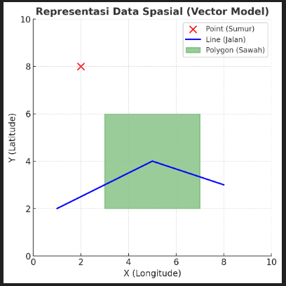

Baik, saya bantu sederhanakan isi teks tentang **Vector Data Model** ini 👇

---

# 📘 **Model Data Vektor (Vector Data Model)**

## 🔑 Inti Sari

1. **Definisi**

   * Model data vektor disebut juga *discrete object model*.
   * Menggunakan **objek diskrit** (terpisah) untuk merepresentasikan fitur di permukaan bumi.
   * Fitur direpresentasikan dalam bentuk **titik, garis, dan poligon**.

2. **Tahapan Pembuatan Data Vektor**

   1. **Klasifikasi fitur spasial** → jadi titik, garis, poligon dengan koordinat (x,y).
   2. **Struktur & hubungan spasial (topologi)** → menentukan bagaimana fitur saling berhubungan.
   3. **Penyimpanan digital** → data disimpan dalam file dengan format tertentu (misalnya `.shp`, geodatabase).

3. **Peran Topologi**

   * Topologi = aturan/relasi spasial antar fitur (misalnya poligon berbatasan dengan poligon lain).
   * Penting dalam GIS untuk analisis spasial yang akurat.

4. **Evolusi Model Data Vektor (contoh ESRI)**

   * **Coverage (Arc/Info):** topologis, geometri & atribut disimpan terpisah.
   * **Shapefile (ArcView):** non-topologis, lebih sederhana.
   * **Geodatabase (ArcGIS):** objek berbasis, geometri & atribut disimpan bersama, topologi bisa dibuat sesuai kebutuhan.

5. **Jenis Fitur**

   * Ada fitur yang lebih baik direpresentasikan sebagai **gabungan titik, garis, dan poligon** (composite features).

---

## 🎯 Kesimpulan

* Model data vektor adalah cara GIS menyimpan data spasial sebagai **objek diskrit (titik, garis, poligon)**.
* Keunggulannya: bisa menyimpan bentuk detail dan hubungan antar fitur.
* ESRI memberi contoh evolusi: **Coverage → Shapefile → Geodatabase**.
* Topologi sangat penting untuk analisis spasial.

---


## 🔄 **1. Apakah ESRI ArcGIS bisa diganti dengan QGIS?**

👉 **Ya, bisa.**

* **ArcGIS** = software komersial dari ESRI, berbayar.
* **QGIS** = software open-source, gratis, dan terus dikembangkan oleh komunitas.

**Perbandingan singkat:**

| Aspek       | ArcGIS                                                            | QGIS                                                                          |
| ----------- | ----------------------------------------------------------------- | ----------------------------------------------------------------------------- |
| Lisensi     | Berbayar                                                          | Gratis (open-source)                                                          |
| Kekuatan    | Dukungan resmi ESRI, banyak tools bawaan                          | Fleksibel, banyak plugin dari komunitas                                       |
| Format      | Sangat optimal untuk format **geodatabase (GDB)**, shapefile, dll | Mendukung banyak format (shapefile, GeoJSON, GeoPackage, bahkan GDB terbatas) |
| Popularitas | Dipakai luas di pemerintahan & perusahaan besar                   | Populer di akademik, NGO, startup, dan pemerintahan juga mulai banyak         |

QGIS bisa menggantikan ArcGIS untuk hampir semua analisis dasar-menengah GIS.

---

## 📂 **2. Bedanya Geodatabase vs GeoJSON**

### 🗄️ **Geodatabase (GDB – ESRI format)**

* Dikembangkan oleh ESRI, lebih cocok di **ArcGIS**.
* Bisa menyimpan:

  * **Geometri (titik, garis, poligon)**
  * **Atribut**
  * **Topologi & aturan validasi**
  * **Relationship antar tabel**
  * **Data raster** dalam satu wadah
* Format **proprietary (tertutup)** → tidak semua software bisa baca penuh.
* Biasanya dipakai untuk **proyek besar dan kompleks** (misalnya data pemerintah skala nasional).

### 🌐 **GeoJSON**

* Format berbasis **JSON (JavaScript Object Notation)**.
* Sangat ringan dan **mudah dibaca manusia**.
* Ideal untuk **aplikasi web & API** (misalnya peta interaktif dengan Leaflet, Mapbox, OpenLayers).
* Hanya menyimpan:

  * **Geometri (Point, LineString, Polygon, MultiPolygon, dll)**
  * **Atribut sederhana**
* Tidak mendukung aturan topologi atau relasi rumit seperti GDB.

---

## ✨ **Kesimpulan**

* Kalau untuk **analisis GIS skala besar & kompleks** → **Geodatabase (ArcGIS lebih optimal)**.
* Kalau untuk **peta online, web GIS, data berbagi lintas platform** → **GeoJSON lebih cocok**.
* QGIS bisa membaca GeoJSON dengan baik, dan untuk GDB terbatas (biasanya harus konversi dulu ke GeoPackage atau shapefile).

---
Baik, saya buatkan tabel perbandingan **Geodatabase vs GeoJSON** supaya lebih jelas 👇

---

## 📊 Perbandingan Geodatabase (GDB) vs GeoJSON

| Aspek                 | **Geodatabase (GDB)**                                                                              | **GeoJSON**                                                     |
| --------------------- | -------------------------------------------------------------------------------------------------- | --------------------------------------------------------------- |
| **Asal / Pengembang** | Dikembangkan oleh **ESRI**                                                                         | Standar terbuka berbasis **JSON**                               |
| **Jenis Format**      | **Proprietary (tertutup)**                                                                         | **Open standard (terbuka)**                                     |
| **Kompatibilitas**    | Optimal di ArcGIS, QGIS bisa baca terbatas                                                         | Didukung luas (QGIS, Leaflet, Mapbox, OpenLayers, PostGIS, dll) |
| **Isi Data**          | Menyimpan **geometri, atribut, topologi, aturan validasi, relasi antar tabel, bahkan raster**      | Menyimpan **geometri + atribut sederhana**                      |
| **Kompleksitas**      | Cocok untuk proyek GIS besar & kompleks (misal: data pemerintah, infrastruktur)                    | Ringan, cocok untuk web, API, dan pertukaran data               |
| **Keterbacaan**       | Tidak mudah dibaca manusia (butuh software khusus)                                                 | Mudah dibaca (hanya teks JSON biasa)                            |
| **Ukuran File**       | Bisa besar, karena kompleks                                                                        | Relatif kecil & ringan                                          |
| **Penggunaan Umum**   | Analisis GIS mendalam di ArcGIS (misalnya perencanaan tata ruang, transportasi, jaringan utilitas) | WebGIS, aplikasi peta online, berbagi data lintas platform      |
| **Contoh Ekstensi**   | `.gdb` (folder), `.mdb` (personal geodatabase)                                                     | `.geojson`, `.json`                                             |

---

👉 Jadi:

* **Geodatabase (GDB)** = cocok untuk **analisis GIS skala besar & detail**.
* **GeoJSON** = cocok untuk **peta online & pertukaran data lintas platform**.

---
Pertanyaan bagus 👍 karena kalau fokusnya ke **WebGIS**, memang **GeoJSON** sering dipakai karena ringan, terbuka, dan mudah diproses di browser.
Tapi benar — **kekurangannya GeoJSON** adalah hanya bisa menyimpan **geometri + atribut sederhana**, tidak ada topologi, aturan validasi, atau relasi kompleks seperti di Geodatabase.

Untuk **menutupi kekurangan GeoJSON**, ada beberapa solusi:

---

## 🔧 Cara Menutupi Kekurangan GeoJSON

| Kebutuhan                                                                 | Kekurangan GeoJSON                                      | Solusi / Tools Tambahan                                                                                                           |
| ------------------------------------------------------------------------- | ------------------------------------------------------- | --------------------------------------------------------------------------------------------------------------------------------- |
| **Relasi antar data** (misalnya relasi antar layer atau antar tabel)      | GeoJSON tidak mendukung relasi                          | Simpan relasi di **database spatial** seperti **PostGIS**, lalu ekspor hasil query ke GeoJSON untuk ditampilkan di web            |
| **Topologi (hubungan antar fitur: adjacency, connectivity, containment)** | Tidak tersedia di GeoJSON                               | Gunakan **PostGIS topology** atau **Turf.js** (JavaScript library) untuk cek hubungan spasial di sisi server / client             |
| **Validasi data spasial** (misal: polygon tidak boleh overlap)            | Tidak ada aturan validasi                               | Validasi di backend dengan **PostGIS ST_ functions**, atau di frontend dengan **Turf.js** / **Mapbox GL JS**                      |
| **Menyimpan dataset besar** (ribuan fitur, performa turun)                | File GeoJSON bisa jadi berat, lambat di-load di browser | Gunakan **Vector Tiles (MVT / PBF format)** → bisa dibuat dari GeoJSON pakai **tippecanoe (Mapbox)** atau QGIS                    |
| **Manajemen data skala besar**                                            | GeoJSON hanya file statis                               | Simpan data utama di **PostGIS / GeoServer**, lalu publish ke WebGIS dalam format GeoJSON, WMS, atau Vector Tiles                 |
| **Edit & update data di web**                                             | GeoJSON tidak punya mekanisme update langsung           | Gunakan API (misalnya **Node.js + Express + PostGIS**) untuk CRUD data spasial, lalu kirim balik ke frontend dalam format GeoJSON |

---

## 🚀 Rekomendasi untuk WebGIS

1. **Gunakan PostGIS + GeoServer** → sebagai penyimpanan & server data.
2. **Publikasikan data** ke frontend dalam **GeoJSON atau Vector Tiles**.
3. **Gunakan library tambahan** di web:

   * **Leaflet** → visualisasi peta ringan.
   * **Turf.js** → analisis spasial (buffer, intersection, distance, dsb) langsung di browser.
   * **Mapbox GL JS / OpenLayers** → untuk peta interaktif & vector tiles.

---

👉 Jadi, GeoJSON tetap dipakai sebagai **format pertukaran data**, tapi untuk analisis, validasi, dan data kompleks, **backend (PostGIS/GeoServer)** + **library web (Turf.js/Mapbox)** akan menutupi kekurangannya.

Baik, saya buatkan **arsitektur sederhana WebGIS** yang bisa kamu pakai sebagai gambaran awal.

---

# 🏗️ Arsitektur Sederhana WebGIS

| **Lapisan**              | **Komponen**                         | **Contoh Tools / Teknologi**                                                    | **Fungsi**                                                                 |
| ------------------------ | ------------------------------------ | ------------------------------------------------------------------------------- | -------------------------------------------------------------------------- |
| **1. Data**              | - Data Spasial<br>- Data Non-Spasial | - **PostgreSQL + PostGIS** (basis data spasial)<br>- Shapefile, GeoJSON, Raster | Menyimpan data geospasial (titik, garis, poligon, raster) beserta atribut. |
| **2. Server GIS**        | - GIS Server untuk penyajian data    | - **GeoServer** / **MapServer**                                                 | Menyajikan data spasial menjadi layanan peta (WMS, WFS, WMTS, dll).        |
| **3. Backend**           | - API / Middleware                   | - **Node.js / Express**, **Django REST Framework**, **Flask**                   | Menjembatani komunikasi antara database/server GIS dengan aplikasi WebGIS. |
| **4. Frontend (Client)** | - WebGIS Viewer                      | - **Leaflet.js**, **OpenLayers**, **Mapbox GL JS**                              | Menampilkan peta interaktif di browser (zoom, pan, query data).            |
| **5. User**              | - Pengguna akhir                     | - Browser (Chrome, Firefox, Edge)                                               | Berinteraksi dengan peta melalui web.                                      |

---

## 🔗 Alur Sederhana

1. **Data** (misalnya peta mangrove dalam PostGIS).
2. **GeoServer** menyajikan peta sebagai layanan WMS/WFS.
3. **Backend** (opsional) mengatur API & autentikasi.
4. **Frontend** (Leaflet/OpenLayers) menampilkan peta.
5. **User** mengakses WebGIS via browser.

---

📌 Kalau kamu ingin lebih ringan dan cepat untuk **WebGIS fokus visualisasi** → cukup gunakan **GeoJSON langsung di Leaflet/OpenLayers**, tapi kalau mau **skala besar + query spasial kompleks** → sebaiknya pakai **PostGIS + GeoServer**.

Baik, saya ringkas dan jelaskan inti sarinya dengan bahasa yang lebih mudah dipahami 👍

---

# 📌 Representasi Data Spasial (Vector Model)

Dalam **GIS (Geographic Information System)**, data spasial bisa direpresentasikan dengan **3 bentuk utama**:

### 1. **Point (Titik)**

* Dimensi: 0D (tidak punya panjang/luas, hanya lokasi).
* Ciri: Ditunjukkan dengan koordinat **(x, y)**.
* Contoh: sumur, tiang listrik, lokasi kota pada peta skala besar.

---

### 2. **Line (Garis / Polyline)**

* Dimensi: 1D (punya panjang, tidak punya luas).
* Ciri: Tersusun dari **dua titik atau lebih** yang saling terhubung.
* Bisa berupa garis lurus atau lengkung.
* Contoh: jalan, sungai kecil, batas wilayah.

---

### 3. **Polygon (Poligon / Area)**

* Dimensi: 2D (punya luas dan keliling).
* Ciri: Tersusun dari garis tertutup yang tidak berpotongan.
* Bisa punya lubang (inner boundary).
* Contoh: danau, gedung, sawah, kota pada peta skala detail.

---

### 🔄 Variasi Geometri Lain

* **MultiPoint** → sekumpulan titik.
* **MultiLineString** → sekumpulan garis.
* **MultiPolygon** → sekumpulan area.
* **GeometryCollection** → campuran berbagai jenis geometri (misalnya 1 titik + 1 garis).

---

### 🗺️ Perbedaan Istilah di Platform

* **Google Maps** → Point, LineString, LinearRing, Polygon.
* **OpenStreetMap (OSM)** → Node (titik), Way (garis/area), Relation (hubungan antar elemen).
* **GeoJSON** → Point, LineString, Polygon, MultiPoint, MultiLineString, MultiPolygon, GeometryCollection.

---

### 📏 Catatan Penting: Skala Peta

* Representasi bisa berubah tergantung **skala peta**:

  * Kota → titik pada skala 1:1.000.000
  * Kota → poligon (area) pada skala 1:24.000
* Lembaga resmi (misalnya USGS) juga punya aturan:

  * Sungai kecil (≤ 40 ft) digambar dengan **garis tunggal**.
  * Sungai besar digambar dengan **garis ganda** → poligon (area).

---

👉 **Inti Sari**:

* Data spasial dalam GIS berbentuk **titik, garis, atau area**.
* Bentuk ini bisa berbeda tergantung skala peta dan aturan kartografi.
* Untuk pertukaran data, digunakan standar seperti **Google Maps, OSM, atau GeoJSON**, yang punya istilah berbeda tapi maksudnya sama.

---


# 📌 Contoh Representasi Data Spasial (Vector Model)

| Bentuk Geometri              | Dimensi          | Cara Simpan (Koordinat)                                | Contoh di Dunia Nyata                                                 | Ilustrasi         |
| ---------------------------- | ---------------- | ------------------------------------------------------ | --------------------------------------------------------------------- | ----------------- |
| **Point (Titik)**            | 0D (lokasi saja) | (x, y) → contoh: (117.12, -1.24)                       | Lokasi rumah, sumur, tiang listrik, posisi kota pada peta skala besar | 🔵 Titik tunggal  |
| **Line (Garis / Polyline)**  | 1D (panjang)     | [(x1,y1), (x2,y2), (x3,y3)...]                         | Jalan raya, sungai kecil, rel kereta, batas wilayah                   | ➖ Garis memanjang |
| **Polygon (Poligon / Area)** | 2D (luas)        | [(x1,y1), (x2,y2), (x3,y3), (x1,y1)] → ditutup kembali | Danau, gedung, sawah, kota (pada peta detail)                         | ⬛ Area tertutup   |

---

# 📍 Contoh Kasus Nyata di Peta

1. **Titik (Point)**

   * Koordinat: (117.120, -1.240)
   * Keterangan: Lokasi **sumur air**.

2. **Garis (Line)**

   * Koordinat: [(117.110, -1.245), (117.130, -1.250)]
   * Keterangan: Jalan penghubung antar desa.

3. **Poligon (Polygon)**

   * Koordinat: [(117.100, -1.240), (117.130, -1.240), (117.130, -1.260), (117.100, -1.260), (117.100, -1.240)]
   * Keterangan: Area **sawah** milik petani.

---

👉 Jadi, dengan 3 bentuk sederhana ini (**Point, Line, Polygon**), hampir semua objek di dunia nyata bisa direpresentasikan di GIS.

Berikut adalah visualisasi sederhana dari **representasi data spasial dengan model vektor**:


<p align="center">
  
</p>


* 🔴 **Point** = Sumur (titik tunggal dengan koordinat tertentu)
* 🔵 **Line** = Jalan (garis yang menghubungkan beberapa titik)
* 🟩 **Polygon** = Sawah (area tertutup dengan batas jelas)

Dengan cara ini, komputer bisa memahami objek nyata di dunia dalam bentuk titik, garis, dan poligon.


Mantap 👍 ini memang bagian yang agak “teoretis” dan bikin bingung di awal, padahal penting banget kalau mau paham **data untuk WebGIS**. Mari saya jelaskan dengan **bahasa sederhana + contoh sehari-hari** supaya lebih mudah dipahami.

---

## 📌 Inti Konsep *Topology* dalam GIS

### 1. Apa itu Topology?

* **Topology** adalah aturan tentang **hubungan antar objek spasial** (titik, garis, area).
* Topology **tidak peduli ukuran atau bentuk** (jarak, luas bisa salah) → yang penting adalah **hubungan antar objeknya tetap benar**.
* Contoh mudah:

  * **Peta jalur MRT/Transjakarta** → jarak antar halte bisa salah, tapi hubungan antar halte & jalurnya tetap benar.
  * **Karet gelang** → mau ditarik atau dibengkokkan, tetap saja lingkaran tertutup.

👉 Jadi, topology itu tentang **“siapa terhubung dengan siapa, siapa ada di sebelah siapa”**, bukan tentang seberapa jauh.

---

### 2. Unsur Dasar Topology (*Topological Primitives*)

* **Node** → titik (contoh: simpang jalan, stasiun, tiang listrik).
* **Arc/Edge** → garis berarah antara node (contoh: ruas jalan, rel kereta).
* **Vertex** → titik di tengah garis (penentu bentuk garis).
* **Face** → area tertutup (contoh: batas kelurahan, sawah, blok perumahan).
* **Adjacency** → siapa tetangga (contoh: Kelurahan A berbatasan dengan Kelurahan B).
* **Incidence** → siapa terhubung (contoh: Jalan X menghubungkan simpang A dan simpang B).

👉 Unsur-unsur ini dipakai untuk memastikan **peta nyambung dengan benar**.

---

### 3. Contoh Data: TIGER (U.S. Census Bureau)

* Digunakan untuk **pemetaan sensus penduduk** di Amerika.
* Data **batas wilayah** (kecamatan, blok) dihubungkan dengan **jalan, sungai, rel kereta**.
* Bisa tahu **alamat ada di sisi kanan atau kiri jalan**.
* Bermanfaat untuk:

  * Geocoding (memetakan alamat ke peta).
  * Analisis lalu lintas atau aliran sungai (arah alir = penting).
  * Pastikan batas wilayah **nyambung, tidak tumpang tindih**.

---

### 4. Kenapa Topology Penting untuk WebGIS?

Kalau kamu bangun WebGIS, topology bikin data:
✅ **Bersih & valid** → polygon tidak bocor, garis tidak terputus.
✅ Bisa dipakai untuk **analisis interaktif**:

* Cari **rute terpendek** (kayak Google Maps).
* Cek alamat masuk ke **wilayah mana**.
* Hitung arah aliran air atau distribusi pipa/listrik.
  ✅ **Lebih efisien** → query lebih cepat karena data punya struktur hubungan.

---

## 📊 Ringkasan (Tabel Sederhana)

| Konsep             | Penjelasan Mudah                      | Contoh Nyata                   |
| ------------------ | ------------------------------------- | ------------------------------ |
| **Topology**       | Hubungan antar objek spasial          | Jalur MRT di peta              |
| **Node**           | Titik simpul                          | Persimpangan jalan             |
| **Arc/Edge**       | Garis berarah                         | Ruas jalan                     |
| **Face**           | Area tertutup                         | Kelurahan, blok                |
| **Adjacency**      | Siapa berbatasan                      | Kelurahan A dengan B           |
| **Incidence**      | Siapa terhubung                       | Jalan X hubungkan simpang A–B  |
| **TIGER DB**       | Data berbasis topologi                | Alamat → sisi kiri/kanan jalan |
| **Manfaat WebGIS** | Data valid, bisa analisis rute/aliran | Google Maps, peta banjir       |

---

## 🔑 Analogi yang Lebih Gampang

Bayangkan **game Mobile Legends / Dota 2**:

* **Node** = base atau tower.
* **Arc** = jalur (lane) yang menghubungkan tower.
* **Face** = area hutan / base.
* **Adjacency** = tower A bersebelahan dengan tower B.
* **Incidence** = jalur mid menghubungkan tower depan dan base.

👉 Sama kayak di GIS, sistem butuh tahu **hubungan antar objek**, bukan cuma gambar peta.

---

➡️ Jadi kalau nanti bikin **WebGIS**, bayangkan:

* Tanpa topology → peta hanya gambar statis.
* Dengan topology → peta “paham hubungan”, bisa dipakai untuk analisis (routing, aliran, geocoding).

---
Oke, mari kita sederhanakan bagian **3.2.2 Importance of Topology** ini supaya lebih mudah dipahami dan nyambung dengan pembelajaran Web GIS.

---

## 📌 Inti dari Pentingnya **Topology** dalam GIS

Topology = aturan **hubungan spasial antar-objek** (misalnya: titik, garis, poligon) dalam peta.
👉 Jadi bukan hanya “gambar peta”, tapi juga “aturan logika” agar data spasial **benar dan bisa dianalisis**.

---

### ✅ 1. **Menjamin Kualitas & Integritas Data**

* Topology bisa mendeteksi kesalahan, contoh:

  * Garis jalan yang **tidak nyambung** padahal harusnya sambung.
  * Poligon wilayah (misalnya batas kabupaten) yang **bolong** atau **tumpang tindih**.
* Analogi: Kalau kamu bikin puzzle, topology memastikan **semua potongan puzzle pas** tanpa celah atau dobel.

💡 Dalam Web GIS → ini penting agar **batas wilayah, jalan, sungai, dan data spasial lain konsisten**, jadi tidak bikin error saat divisualisasi.

---

### ✅ 2. **Meningkatkan Analisis GIS**

* Topology membuat analisis lebih **pintar**, contoh:

  * **Geocoding alamat** → menentukan posisi rumah di sebelah kiri atau kanan jalan (butuh info kiri/kanan).
  * **Analisis arus** → aliran sungai atau lalu lintas butuh arah (flow direction).
  * **Habitat satwa** → garis batas hutan vs lahan terbuka bisa dihitung luas per tipe habitat.

💡 Dalam Web GIS → topology memungkinkan **fitur interaktif**, seperti melacak **rute jalan**, memodelkan **aliran sungai**, atau analisis **sebaran alamat**.

---

### ✅ 3. **Memungkinkan Query Data Spasial**

* Dengan hubungan topologi, kita bisa tanya data spasial, misalnya:

  * “Berapa jumlah sekolah di dalam kabupaten A?” (containment).
  * “Tanah mana yang terpotong oleh patahan gempa?” (intersect).
* Analogi: Topology itu kayak **logika query SQL**, tapi untuk data spasial.

💡 Dalam Web GIS → ini dipakai untuk fitur **filter dan pencarian spasial**, contohnya di peta online:

* Klik wilayah → muncul jumlah fasilitas kesehatan di dalamnya.
* Gambar garis → muncul semua jalan yang dipotong garis itu.

---

## 🗂️ Ringkasannya

Topology penting karena:

1. **Data lebih bersih & valid** → tidak ada garis putus, batas bolong.
2. **Analisis lebih kuat** → bisa tahu kiri/kanan jalan, arah aliran, luas habitat, dll.
3. **Query spasial lebih canggih** → bisa tanya “apa yang ada di dalam”, “apa yang bersinggungan”, dll.

---

👉 Jadi, untuk Web GIS nanti, kalau kamu pakai data dengan topology:

* Peta **lebih akurat**
* Analisis **lebih mendalam**
* Interaksi **lebih kaya (search, filter, query spasial)**

---

Oke, saya bantu jelaskan bagian **3.3 Georelational Data Model** dengan bahasa yang lebih sederhana dan mudah dipahami, plus analogi supaya lebih nyambung dengan konteks **WebGIS**.

---

## 📌 Inti Konsep Georelational Data Model

Georelational data model itu sederhananya cara **menyimpan data spasial (peta/geo)** dan **data atribut (informasi tambahan)** secara **terpisah**, tapi tetap bisa **terhubung** lewat sebuah **ID unik**.

* **Geo (spasial)** → bentuk/geometri: titik, garis, poligon (disimpan di file grafik/spasial).
* **Relational (atribut)** → informasi tambahan: nama, luas, jenis, pemilik (disimpan di database tabel).
* **Kunci penghubung** → ID unik yang menyamakan keduanya.

➡️ Jadi, kalau ada sebuah poligon "Hutan Mangrove", bentuk peta poligonnya disimpan di file grafik, sedangkan atributnya (misalnya nama desa, jenis mangrove, luas area) disimpan di tabel database.

---

## 📌 Contoh Sederhana

Misalnya kita ingin menyimpan **peta sekolah di kota Balikpapan**:

1. **File spasial (Geo)**

   * Titik koordinat lokasi sekolah.
   * Contoh: `Sekolah A = (x=116.83, y=-1.27)`

2. **Database atribut (Relational)**

   * Informasi detail tiap sekolah.
   * Contoh tabel:

     ```
     ID   | Nama Sekolah     | Jumlah Siswa | Status
     ------------------------------------------------
     1    | SDN 01 Balikpapan | 350          | Negeri
     2    | SMPN 02 Balikpapan| 500          | Negeri
     3    | SMA Swasta Cerdas | 200          | Swasta
     ```

3. **ID sebagai penghubung**

   * Titik di file spasial punya ID = 1, 2, 3
   * ID ini dipakai untuk menghubungkan ke tabel atribut.

👉 Jadi ketika kita klik titik sekolah di peta WebGIS, sistem akan cari ID titik itu, lalu ambil data atributnya dari tabel.

---

## 📌 Bedanya Coverage dan Shapefile

* **Coverage (lama, model awal Esri)**

  * Menyimpan data spasial + atribut terpisah.
  * Sudah mendukung **topologi** (hubungan antar objek, misalnya batas dua poligon sama persis, jalan saling terhubung).

* **Shapefile (lebih populer & masih dipakai sampai sekarang)**

  * Juga pisah antara file spasial dan atribut (.shp, .dbf, .shx).
  * **Tidak menyimpan topologi** → kalau dua poligon berbatasan, sistem tidak otomatis tahu mereka harus pas tanpa celah.

---

## 📌 Analogi Mudah

Bayangkan **kartu perpustakaan**:

* **Foto peminjam** = data spasial (bentuk visual).
* **Data identitas (nama, alamat, nomor telp)** = atribut.
* **Nomor anggota** = ID penghubung.

Tanpa nomor ID, foto dan data tidak bisa dicocokkan. Begitu juga di GIS, tanpa ID unik, peta dan tabel tidak bisa saling bicara.

---

## 📌 Inti yang Perlu Kamu Ingat untuk WebGIS

1. Georelational = data spasial + data atribut dipisah, tapi dihubungkan ID.
2. Coverage = topologis, shapefile = non-topologis.
3. Kelebihan → fleksibel, bisa simpan peta besar dengan data detail.
4. Kekurangan → harus sinkron, kalau ID rusak data bisa tidak nyambung.

---

Oke, saya jelaskan bagian **Shapefile (3.3.3)** ini dengan bahasa yang lebih sederhana supaya lebih mudah dipahami, terutama untuk mendukung pemahamanmu di **WebGIS**.

---

## 📌 Inti dari Shapefile

* **Shapefile** adalah **format data spasial non-topologi** yang sangat populer, terutama di software **Esri (ArcGIS)**.
* Disebut *non-topologi* karena shapefile **tidak menyimpan hubungan spasial** antar objek (contoh: dua poligon yang berbatasan tetap disimpan terpisah, tanpa tahu bahwa mereka berbagi garis batas).

---

## 📂 Struktur File Shapefile

Sebenarnya **satu shapefile** terdiri dari beberapa file, minimal:

* **.shp** → menyimpan geometri (titik, garis, poligon).
* **.shx** → index untuk mempercepat pencarian geometri.
* **.dbf** → tabel atribut (format mirip Excel/DBF).

📌 Jadi: **.shp + .shx + .dbf = 1 dataset shapefile**.
Kalau salah satu hilang, shapefile bisa rusak/tidak terbaca.

---

## ⚖️ Kelebihan Shapefile

1. **Cepat ditampilkan** → karena tidak menyimpan hubungan antar objek, hanya geometri dan atribut sederhana.
   → Cocok untuk **user yang hanya melihat data (viewer)**.

2. **Interoperabilitas tinggi** → Shapefile bisa dibuka di berbagai software GIS (ArcGIS, QGIS, MapInfo, bahkan Python/GeoPandas).
   → Inilah alasan shapefile jadi **standar data spasial global** sejak 1990-an.

---

## ❌ Kekurangan Shapefile

* **Tidak menyimpan topologi** (tidak tahu mana yang berbatasan, mana yang di dalam).
  Contoh: Poligon kabupaten bisa tumpang tindih atau ada celah di batasnya.
* **Ukuran terbatas** → atribut di .dbf maksimal **10 karakter nama field** dan panjang teks juga terbatas.
* **Multi-file** → ribet dipindah karena harus bawa semua file pendukung (.shp, .shx, .dbf, .prj, dll).

---

## 🔗 Relevansi untuk WebGIS

Kalau kamu bangun **WebGIS**, biasanya:

* **Shapefile digunakan untuk input** (upload data ke server).
* Lalu dikonversi ke **GeoJSON** atau disimpan di **PostGIS** agar lebih mudah dipakai di web.
* Shapefile bagus untuk **bertukar data antar software**, tapi kurang efisien untuk **aplikasi web real-time**.

---

### 🎯 Analogi Mudah

Bayangkan **shapefile itu kayak file .zip** yang terdiri dari beberapa file di dalamnya:

* **.shp** = isi barang (geometri peta).
* **.shx** = daftar isi (index posisi barang).
* **.dbf** = label atau keterangan barang (atribut).

Tapi shapefile **tidak tahu hubungan antar barang**. Misalnya ada dua kotak yang sebenarnya menempel, shapefile tetap menyimpannya sebagai dua kotak terpisah.

---

Baik, saya bantu sederhanakan bagian **Object-Based Data Model (3.4)** ini biar lebih mudah dipahami, terutama dengan contoh yang relevan ke **WebGIS**.

---

# 📌 Inti Konsep: Object-Based Data Model

Model data berbasis objek dalam GIS adalah pendekatan **paling modern** dibandingkan dengan shapefile (non-topologi) atau georelational (topologi).

👉 Prinsip utamanya:

1. **Data spasial (geometri) dan atribut disimpan dalam satu wadah** (tidak terpisah seperti shapefile yang punya `.shp` dan `.dbf`).

   * Geometri disimpan di kolom khusus tipe **BLOB (Binary Large Object)**.
   * Atribut tetap dalam tabel.
     → Misalnya: satu tabel menyimpan langsung *bentuk poligon* + *nama + luas + kategori*.

2. **Setiap data dianggap sebagai objek** yang punya:

   * **Properti (attributes)** → seperti "nama jalan", "panjang", "tipe permukaan".
   * **Metode (methods)** → aksi yang bisa dilakukan, misalnya "salin", "hapus", "potong", "gabung".

---

## 📦 Contoh Sederhana

Bayangkan kita punya objek **Jalan** dalam WebGIS:

* **Properti:** nama = "Jl. Sudirman", panjang = 2 km, tipe = "aspal".
* **Metode:** tampilkan di peta, hapus, tambahkan simpang, hitung panjang.

Kalau pakai shapefile → hanya data statis.
Kalau pakai object-based → bisa langsung punya perilaku (aksi) yang bisa dipanggil.

---

# 📚 3.4.1 Classes dan Hubungannya

Karena hampir semua di GIS dianggap **objek**, maka dikelompokkan dalam **class**.
Contoh: ada class `Jalan`, `Bangunan`, `Sungai`, `PoligonLahan`, dsb.

Lalu antar class punya hubungan **OOP (Object-Oriented Programming)** seperti di pemrograman.

### 🔗 Jenis Hubungan (dengan contoh mudah):

1. **Association (Asosiasi)**
   → Satu objek berhubungan dengan objek lain.
   📍 Contoh: *Satu alamat punya 1 kode pos, tapi bisa terkait dengan banyak apartemen.*

2. **Aggregation (Agregasi / whole-part)**
   → Hubungan bagian dari sesuatu yang lebih besar, tapi masih bisa berdiri sendiri.
   📍 Contoh: *Satu kecamatan terdiri dari banyak desa. Desa bisa tetap ada meskipun kecamatan berubah.*

3. **Composition (Komposisi / whole-part yang wajib menyatu)**
   → Bagian tidak bisa ada tanpa keseluruhan.
   📍 Contoh: *Rest area ada karena ada jalan tol. Kalau jalan tol dihapus, rest area ikut hilang.*

4. **Inheritance (Pewarisan / generalisasi-spesialisasi)**
   → Kelas umum bisa diturunkan jadi kelas khusus.
   📍 Contoh: *Bangunan → punya subclass "Rumah", "Sekolah", "Rumah Sakit".*
   Rumah mewarisi properti bangunan (luas, tinggi), tapi bisa punya tambahan properti (jumlah kamar).

5. **Instantiation (Instansiasi)**
   → Membuat objek nyata dari class.
   📍 Contoh: Dari class `Rumah`, kita buat objek nyata `Rumah_A1` di peta dengan atribut spesifik: luas = 120 m², warna atap = merah.

---

# 🔗 Relevansi ke WebGIS

* Dengan model berbasis objek, data spasial bisa diatur seperti **OOP di pemrograman web**.
* Cocok dengan **PostGIS, GeoServer, ArcGIS Enterprise** → karena semuanya sudah berbasis objek.
* Dalam WebGIS, ini memudahkan:

  * Query interaktif (misalnya klik jalan → langsung tahu panjangnya).
  * Analisis otomatis (misalnya semua sungai dalam radius 5 km dari jalan utama).
  * Interaksi lebih dinamis dibanding shapefile biasa.

---

# 🎯 Analogi Sehari-hari

* **Shapefile** = seperti file Excel yang hanya berisi daftar barang. Barangnya ada, tapi pasif.
* **Object-based data model** = seperti **aplikasi e-commerce** (Tokopedia/Shopee).

  * Barang (produk) = objek.
  * Properti = nama, harga, stok.
  * Metode = tambah ke keranjang, hapus, checkout.
    → Jadi bukan cuma menyimpan data, tapi juga punya perilaku.

---

Mau saya buatkan **ilustrasi visual sederhana (diagram objek + properti + metode, plus contoh hubungannya)** biar lebih mudah dipahami kayak gambar OOP di pemrograman?


Oke, saya coba sederhanakan isi teks panjang ini agar lebih gampang dipahami, dan saya hubungkan juga dengan konteks **belajar Web GIS**.

---

## 📌 Inti Penjelasan tentang Interface & ArcObjects

1. **Interface**

   * Interface itu seperti **kontrak** atau **pintu masuk** ke sebuah objek/kelas.
   * Objek punya banyak hal di dalamnya (data & fungsi), tapi yang boleh kita lihat/pakai hanya yang ditampilkan lewat interface.
   * Ini mirip seperti **remote TV**: kamu tidak perlu tahu bagaimana TV bekerja di dalamnya, cukup pencet tombol di remote (interface), TV akan bereaksi.

---

2. **Contoh di GIS (ArcObjects)**

   * Ada objek bernama **Feature**.
   * Feature ini punya interface bernama **IFeature**.
   * Lewat IFeature, kita bisa mengakses:

     * **Extent** → batas area dari fitur (hanya bisa dilihat, read-only).
     * **Shape** → bentuk geometrinya (bisa dibaca & diubah).
     * **Delete()** → metode untuk menghapus fitur.

   Jadi, interface mengontrol **apa yang bisa dilakukan terhadap objek GIS**.

---

3. **Contoh lain (Figure 3.14)**

   * Objek **Geodataset** (misalnya feature layer) punya interface **IGeodataset**.
   * Dari situ kita bisa akses **Extent** (batas wilayah layer).
   * Extent mengembalikan objek **Envelope**, yang punya interface **IEnvelope**.
   * Lewat IEnvelope, kita bisa tahu koordinat batas wilayah: **XMin, XMax, YMin, YMax**.

   ➝ Jadi, lewat “rantai interface” inilah kita bisa **menghitung luas area peta**.

---

4. **ArcObjects & ArcGIS**

   * ArcObjects itu “mesin” yang ada di balik ArcGIS.
   * User biasa tidak perlu pusing, karena sudah ada menu, ikon, dialog yang dibuat ESRI.
   * Tapi kalau mau **kustomisasi** (bikin tool sendiri, menu tambahan, atau analisis otomatis), kita bisa pakai bahasa pemrograman seperti **Python, C#, atau VB.NET** untuk berinteraksi langsung dengan ArcObjects lewat interface.
   * Mulai ArcGIS 10, ada **Python Window** di ArcMap/ArcCatalog yang bisa langsung eksekusi script.

---

## 🎯 Bagaimana ini membantu untuk Belajar **Web GIS**?

* Konsep **interface** penting dalam pemrograman, bukan hanya di ArcGIS tapi juga di **Web GIS**.
* Contoh paralelnya:

  * Dalam Web GIS, kamu tidak langsung akses data di database, tapi lewat **API** (Application Programming Interface).
  * API = Interface → yang memungkinkan kita ambil data (misalnya koordinat, peta, batas area) tanpa harus tahu cara kerja database di belakangnya.
* Contoh nyata:

  * Pakai **Leaflet** atau **OpenLayers** → kamu cukup pakai fungsi `.addLayer()` untuk tampilkan peta. Kamu tidak perlu tahu bagaimana library menggambar tile map di layar.
  * Sama halnya dengan **ArcGIS REST API** → cukup request ke endpoint, API (interface) akan mengembalikan data JSON berisi geometri/atribut.

---

## 🧩 Analogi sehari-hari:

* **Interface = Remote TV** → tombol = operasi yang boleh kamu lakukan.
* **Objek = TV** → ada mesin rumit di dalam, tapi kamu tidak perlu lihat semuanya.
* **API Web GIS = Remote Peta Online** → kamu panggil perintah sederhana, sistem di belakang yang rumit mengembalikan data yang kamu minta.

---

👉 Jadi kalau nanti kamu bangun **Web GIS**, kamu akan sering ketemu konsep **interface & API** untuk:

* Ambil data (misalnya GeoJSON dari server).
* Manipulasi peta (zoom, pan, hitung luas).
* Integrasi dengan database GIS (PostGIS, ArcGIS Server).

---

Oke, saya kasih contoh kecil **Web GIS** yang menggunakan **interface berupa API**.
Di sini saya pakai **Leaflet.js** (library peta populer di web) dan ambil data dari API publik (misalnya GeoJSON dari layanan data).

---

## 📌 Contoh Kode Web GIS sederhana dengan API

```html
<!DOCTYPE html>
<html>
<head>
  <title>Contoh Web GIS API</title>
  <meta charset="utf-8" />
  <meta name="viewport" content="width=device-width, initial-scale=1.0">

  <!-- Leaflet CSS -->
  <link rel="stylesheet" href="https://unpkg.com/leaflet/dist/leaflet.css"/>
  <style>
    #map { height: 500px; }
  </style>
</head>
<body>
  <h3>🌍 Web GIS dengan API (GeoJSON)</h3>
  <div id="map"></div>

  <!-- Leaflet JS -->
  <script src="https://unpkg.com/leaflet/dist/leaflet.js"></script>
  <script>
    // 1. Inisialisasi peta
    var map = L.map('map').setView([-6.2, 106.8], 10); // Jakarta

    // 2. Tambahkan basemap dari OpenStreetMap (ini juga API tile map)
    L.tileLayer('https://{s}.tile.openstreetmap.org/{z}/{x}/{y}.png', {
      attribution: '© OpenStreetMap contributors'
    }).addTo(map);

    // 3. Ambil data dari API (contoh: GeoJSON batas admin Jakarta dari GitHub)
    var url = "https://raw.githubusercontent.com/superpikar/geojson-demo/main/jakarta.geojson";

    fetch(url) // Panggil API
      .then(res => res.json())
      .then(data => {
        // 4. Tambahkan data GeoJSON ke peta
        L.geoJSON(data, {
          style: { color: "red", weight: 2 }
        }).addTo(map);
      });
  </script>
</body>
</html>
```

---

## 📖 Penjelasan

1. **Leaflet map** dibuat di `<div id="map">`.
2. **Basemap OSM** diambil lewat **API tile map** (`https://{s}.tile.openstreetmap.org/{z}/{x}/{y}.png`).

   * Kita tidak perlu tahu server OSM cara simpan data, cukup pakai "interface"-nya (API tile).
3. **Data GeoJSON** diambil dari **API/endpoint** (contoh file GeoJSON Jakarta dari GitHub).

   * `fetch(url)` → cara kita panggil API.
   * API mengembalikan data dalam format **GeoJSON**.
4. Data ditampilkan dengan `L.geoJSON()` ke peta.

---

🎯 Dengan pola ini, di Web GIS kamu cukup:

* **Panggil API** → dapat data (misalnya GeoJSON/JSON).
* **Render dengan library** (Leaflet/OpenLayers).
* Tidak perlu tahu cara penyimpanan data di database (PostGIS/ArcGIS Server).

---

Mantap 👍, kalau backend-nya pakai **Laravel (PHP)**, kita bisa bikin API yang membaca data dari **PostGIS** (PostgreSQL + ekstensi GIS) lalu mengirimkannya ke **frontend Web GIS** dalam format **GeoJSON**.

---

## 📌 Alur Besar

1. **Database**: PostgreSQL dengan ekstensi PostGIS → menyimpan data geospasial (misalnya tabel `daerah`).
2. **Backend Laravel**: Buat **API endpoint** (misalnya `/api/daerah`) yang query ke PostGIS → hasilnya diubah jadi GeoJSON.
3. **Frontend (Leaflet)**: Ambil data GeoJSON lewat API Laravel → render di peta.

---

## 🗄️ Contoh Database (PostGIS)

```sql
CREATE TABLE daerah (
    id SERIAL PRIMARY KEY,
    nama VARCHAR(100),
    geom GEOMETRY(POLYGON, 4326)
);
```

Isi contoh data:

```sql
INSERT INTO daerah (nama, geom)
VALUES 
('Area A', ST_GeomFromText('POLYGON((106.7 -6.3,106.9 -6.3,106.9 -6.1,106.7 -6.1,106.7 -6.3))', 4326));
```

---

## ⚙️ Laravel Backend (API GeoJSON)

### 1. Buat Route (routes/api.php)

```php
use App\Http\Controllers\DaerahController;

Route::get('/daerah', [DaerahController::class, 'index']);
```

---

### 2. Controller (app/Http/Controllers/DaerahController.php)

```php
<?php

namespace App\Http\Controllers;

use Illuminate\Support\Facades\DB;

class DaerahController extends Controller
{
    public function index()
    {
        // Query ambil data dari PostGIS dalam format GeoJSON
        $geojson = DB::select("
            SELECT jsonb_build_object(
                'type', 'FeatureCollection',
                'features', jsonb_agg(features.feature)
            ) AS geojson
            FROM (
              SELECT jsonb_build_object(
                'type', 'Feature',
                'geometry', ST_AsGeoJSON(geom)::jsonb,
                'properties', jsonb_build_object(
                    'id', id,
                    'nama', nama
                )
              ) AS feature
              FROM daerah
            ) features;
        ");

        return response()->json($geojson[0]->geojson);
    }
}
```

👉 Query ini akan menghasilkan **GeoJSON valid**, misalnya:

```json
{
  "type": "FeatureCollection",
  "features": [
    {
      "type": "Feature",
      "geometry": {"type":"Polygon","coordinates":[...]},
      "properties": {"id":1,"nama":"Area A"}
    }
  ]
}
```

---

## 🌍 Frontend (Leaflet, ambil dari API Laravel)

```html
<!DOCTYPE html>
<html>
<head>
  <title>Web GIS Laravel + PostGIS</title>
  <meta charset="utf-8" />
  <link rel="stylesheet" href="https://unpkg.com/leaflet/dist/leaflet.css"/>
  <style>#map { height: 500px; }</style>
</head>
<body>
  <h3>🌍 Web GIS - Data dari PostGIS (via Laravel API)</h3>
  <div id="map"></div>

  <script src="https://unpkg.com/leaflet/dist/leaflet.js"></script>
  <script>
    // 1. Inisialisasi peta
    var map = L.map('map').setView([-6.2, 106.8], 11);

    // 2. Tambahkan tile map
    L.tileLayer('https://{s}.tile.openstreetmap.org/{z}/{x}/{y}.png', {
      attribution: '© OpenStreetMap contributors'
    }).addTo(map);

    // 3. Ambil data GeoJSON dari API Laravel
    fetch("http://localhost:8000/api/daerah")
      .then(res => res.json())
      .then(data => {
        // 4. Tambahkan ke peta
        L.geoJSON(data, {
          style: { color: "blue", weight: 2 }
        }).addTo(map);
      });
  </script>
</body>
</html>
```

---

## 🔑 Intinya

* **PostGIS** = tempat simpan data geospasial.
* **Laravel API** = interface (jembatan) → mengubah query PostGIS menjadi **GeoJSON**.
* **Leaflet (Frontend)** = menampilkan peta berdasarkan GeoJSON dari API.

---

Mau saya bikinkan juga **fitur tambahan** di API ini? Misalnya:

* Filtering data berdasarkan nama/lokasi (`/api/daerah?nama=Area A`)
* Endpoint untuk **menambah data ke PostGIS** (POST GeoJSON ke API)

Oke, saya sederhanakan isi teks panjang ini supaya lebih mudah dipahami dan bisa nyambung dengan **belajar Web GIS** 👍

---

## 📌 Inti Penjelasan tentang Geodatabase

1. **Bentuk Data dalam GIS (Vector)**

   * Sama seperti shapefile, **geodatabase** juga pakai **point, polyline, polygon**:

     * **Point** → posisi tunggal (contoh: lokasi rumah sakit).
     * **Multipoint** → beberapa titik sekaligus (contoh: posisi sensor cuaca).
     * **Polyline** → garis (bisa nyambung/tidak), contoh: jalan atau sungai.
     * **Polygon** → area tertutup, contoh: batas kota, danau.
     * **Ring** → bagian penyusun polygon, yaitu garis yang tertutup tanpa berpotongan.

---

2. **Struktur Geodatabase**

   * Data disimpan dalam **Feature Class** dan **Feature Dataset**:

     * **Feature Class** → kumpulan fitur dengan **tipe geometri yang sama**.
       (misalnya: semua polygon untuk “batas kecamatan”).
     * **Feature Dataset** → kumpulan beberapa feature class yang punya **sistem koordinat & area yang sama**.
       (misalnya: satu dataset berisi “blok sensus, kecamatan, dan kabupaten” untuk 1 wilayah).
   * Kalau feature class tidak masuk dataset → disebut **standalone feature class**.
   * Selain itu, geodatabase juga bisa simpan:

     * **Raster** (citra satelit)
     * **TIN** (model permukaan 3D)
     * **Tabel atribut** (data non-spasial)

---

3. **Jenis Geodatabase**

   * **Single-user (untuk 1 orang)**

     * **Personal Geodatabase** → berbasis Microsoft Access, ukuran max 2 GB.
     * **File Geodatabase** → berbentuk folder dengan banyak file kecil.
       ✅ Lebih cepat, tidak ada batas ukuran, bisa dipakai di Windows & Linux.
   * **Multi-user (ArcSDE Geodatabase)** → disimpan di server database besar (contoh: PostgreSQL, Oracle).
     Cocok untuk proyek besar dengan banyak user (misalnya pemetaan nasional).

---

4. **Topology (Hubungan Spasial)**

   * **Topology** = aturan hubungan antar-objek. Misalnya:

     * Batas dua kecamatan harus **berimpit** (tidak ada celah/overlap).
     * Jalan harus **tersambung** dengan benar.
   * Ada dua cara simpan topology:

     * **Persistent Topology** → hubungan spasial disimpan langsung di database (contoh: data TIGER di AS).
     * **On-the-fly Topology** → hubungan dihitung **saat dibutuhkan** (contoh: geodatabase ESRI).

---

## 🎯 Kaitan dengan Web GIS

Kalau nanti kamu bikin **Web GIS**, konsep ini penting karena:

* **Feature Class** ≈ tabel di database → nanti kamu ambil datanya lewat API (format GeoJSON/JSON).
* **Feature Dataset** ≈ kumpulan tabel yang saling terkait → misalnya dataset “Administrasi Kota” berisi kelurahan, kecamatan, dan kabupaten.
* **File Geodatabase / PostGIS** → sumber data yang bisa diakses dari backend Laravel/PHP lalu dikirim ke frontend (Leaflet, OpenLayers).
* **Topology** penting untuk validasi data di Web GIS. Contoh: jangan sampai ada polygon wilayah yang overlap, atau jalan yang “putus”.

---

## 🧩 Analogi Sehari-hari

* Bayangkan **geodatabase** seperti **perpustakaan**:

  * **Feature Class** = 1 rak berisi buku dengan jenis yang sama (semua buku geografi).
  * **Feature Dataset** = kumpulan beberapa rak yang masih dalam 1 kategori besar (semua rak untuk “ilmu bumi”: geografi, geologi, peta kota).
  * **Standalone Feature Class** = buku yang berdiri sendiri, tidak masuk ke rak mana pun.
  * **Topology** = aturan tata letak buku (misalnya: tidak boleh ada buku dobel atau salah tempat).

---

👉 Jadi untuk **Web GIS**, yang penting kamu pahami:

1. Data vektor = point, line, polygon.
2. Geodatabase = tempat simpan data, bisa kecil (file) atau besar (server multi-user).
3. API di Web GIS = cara mengeluarkan data (misalnya GeoJSON) dari geodatabase ke web.
4. Topology = aturan supaya data di peta **benar** dan tidak rancu.

---

ke, saya bantu sederhanakan ya agar lebih mudah dipahami, terutama dengan contoh sehari-hari biar nyambung ke **Web GIS**.

---

## 🔑 Inti dari "Topology Rules" dalam GIS

Topology dalam GIS adalah **aturan hubungan spasial antar objek geografis**.
Tujuannya: **data spasial jadi rapi, konsisten, dan tidak menimbulkan error saat dianalisis.**

---

## 📌 Analogi Sederhana

Bayangkan kamu lagi bikin **peta kota digital** untuk Web GIS: ada **jalan, batas kota, dan rumah**.
Kalau tidak ada aturan (topology rules), bisa saja:

* Batas kota saling tumpang tindih (dua kota numpuk di satu tempat).
* Ada “lubang kosong” di dalam kota (gap).
* Jalan buntu yang harusnya nyambung tapi ternyata terputus.
* Rumah “mengambang” di luar batas kota.

Nah, topology rules dipakai supaya hal-hal ini **nggak terjadi**.

---

## 📊 Jenis Topology Rules (Sederhana)

1. **Polygon (wilayah)**

   * Tidak boleh saling tumpang tindih.
   * Tidak boleh ada celah kosong.
   * Contoh: Peta **provinsi** → Kalimantan Timur tidak boleh overlap dengan Kalimantan Selatan, dan semua wilayah harus nutup rapat tanpa bolong.

2. **Line (garis)**

   * Tidak boleh ada potongan garis “menggantung” (dangle).
   * Tidak boleh saling potong sembarangan.
   * Contoh: **Jaringan jalan** → jalan tol harus nyambung, bukan putus di tengah atau nabrak jalan lain tanpa simpang.

3. **Point (titik)**

   * Harus berada di dalam poligon tertentu.
   * Bisa diwajibkan berada di ujung garis.
   * Contoh: **Sekolah (titik)** harus berada di dalam area kota (poligon), bukan di tengah laut.

---

## 📘 Aplikasi dalam Web GIS

Kalau kamu bikin **Web GIS** (misalnya pakai Laravel + PostGIS + Leaflet):

* **Data validasi** → Sebelum ditampilkan ke user, data dicek pakai topology rules. Misalnya saat user input titik lokasi rumah, sistem pastikan rumahnya ada dalam batas kelurahan.
* **Analisis spasial** → Topology rules bikin query PostGIS lebih akurat. Contoh: cari jalan yang **saling bersinggungan** dengan sungai, atau cari poligon desa yang **tidak overlap**.
* **User experience** → Data yang konsisten bikin peta lebih rapi, nggak ada “lubang” atau “tumpang tindih” aneh.

---

## 🎯 Kesimpulan

* **Topology = aturan hubungan antar objek di peta.**
* Fungsinya: menjaga kualitas data spasial supaya tidak ada error.
* Analogi gampang: kaya bikin puzzle → semua keping harus nyambung pas, nggak boleh bolong, nggak boleh numpuk.
* Dalam Web GIS, topology rules sangat penting untuk validasi data input & menjaga integritas analisis.

---

Mau saya bikinkan contoh **query PostGIS** sederhana untuk ngecek topology rule? Misalnya: **cari poligon wilayah yang overlap atau punya gap** biar langsung nyambung ke teknis Web GIS?


Sip, mari kita langsung ke contoh teknis ya biar nyambung ke **Web GIS dengan PostGIS**.
Misalkan kamu punya tabel **kecamatan** (poligon) di PostGIS. Kita mau cek beberapa topology rules pakai query SQL.

---

## 📘 Dataset Contoh

```sql
CREATE TABLE kecamatan (
    id SERIAL PRIMARY KEY,
    nama VARCHAR(100),
    geom GEOMETRY(POLYGON, 4326) -- pakai SRID WGS84
);
```

Isinya bisa berupa poligon batas kecamatan di satu kota.

---

## 🔎 1. Cek Poligon yang **Overlap**

Apakah ada kecamatan yang saling tumpang tindih?

```sql
SELECT a.id AS id1, b.id AS id2, a.nama AS kec1, b.nama AS kec2
FROM kecamatan a, kecamatan b
WHERE a.id < b.id
  AND ST_Overlaps(a.geom, b.geom);
```

➡️ Hasilnya: daftar kecamatan yang saling **tumpang tindih**.

---

## 🔎 2. Cek Poligon yang **Berlubang / ada gap**

Kadang antar poligon harus nutup rapat (contoh: batas kota). Kita bisa cek dengan union seluruh poligon lalu bandingkan dengan convex hull.

```sql
SELECT ST_AsText(ST_SymDifference(
    ST_Union(geom), 
    ST_ConvexHull(ST_Union(geom))
)) AS gap_geom
FROM kecamatan;
```

➡️ Kalau ada hasil geometrinya, berarti ada **gap (lubang kosong)** antar poligon.

---

## 🔎 3. Cek Poligon yang **Tidak Nyambung (dangle boundary)**

Kadang batas antar poligon tidak rapat → masih ada celah kecil. Bisa dicek dengan `ST_Touches`.

```sql
SELECT a.id, b.id, a.nama, b.nama
FROM kecamatan a, kecamatan b
WHERE a.id < b.id
  AND NOT ST_Touches(a.geom, b.geom)
  AND ST_DWithin(a.geom, b.geom, 0.001);
```

➡️ Cek apakah ada poligon yang hampir nempel tapi tidak rapat → bisa dianggap error digitasi.

---

## 🔎 4. Cek Titik (Point) Harus Berada di dalam Poligon

Misal kita punya tabel `sekolah` (point). Sekolah **harus ada di dalam kecamatan**.

```sql
SELECT s.id, s.nama
FROM sekolah s
LEFT JOIN kecamatan k
ON ST_Contains(k.geom, s.geom)
WHERE k.id IS NULL;
```

➡️ Menampilkan sekolah yang **tidak berada di dalam kecamatan mana pun** → error topology.

---

## 🔎 5. Cek Jalan (Line) yang Putus

Misal tabel `jalan` (line). Kita cek apakah ada garis yang **dangle** (ujung tidak nyambung ke jalan lain).

```sql
SELECT j1.id, ST_EndPoint(j1.geom) AS ujung
FROM jalan j1
LEFT JOIN jalan j2
ON ST_DWithin(ST_EndPoint(j1.geom), j2.geom, 0.0001)
WHERE j2.id IS NULL;
```

➡️ Menampilkan jalan yang **ujungnya putus**.

---

## 🎯 Kesimpulan

Dengan query PostGIS ini kamu bisa **memvalidasi data spasial** sebelum dipakai di **Web GIS**.

* Poligon: tidak boleh overlap/gap.
* Garis: tidak boleh putus atau tumpang tindih sembarangan.
* Titik: harus sesuai aturan (misalnya ada di dalam poligon).

---

Mau saya bikinkan **versi Laravel Eloquent Query** untuk cek salah satu rule ini (misalnya "sekolah harus ada di dalam kecamatan") supaya langsung bisa dipakai di API Web GIS kamu?


Oke, saya bikinkan versi **Laravel Eloquent Query** untuk salah satu rule tadi → misalnya **“Sekolah harus ada di dalam kecamatan”** (point harus berada di dalam polygon).

---

### 📘 Struktur Tabel

* `kecamatan` → kolom: `id`, `nama`, `geom` (POLYGON - PostGIS)
* `sekolah` → kolom: `id`, `nama`, `geom` (POINT - PostGIS)

---

### 📌 Query SQL (dasar PostGIS)

```sql
SELECT s.id, s.nama
FROM sekolah s
LEFT JOIN kecamatan k
    ON ST_Contains(k.geom, s.geom)
WHERE k.id IS NULL;
```

👉 menampilkan sekolah yang **tidak berada di dalam kecamatan mana pun**.

---

### 📌 Laravel Eloquent (Query Builder)

Kita bisa jalankan SQL ini lewat Eloquent / Query Builder:

```php
use Illuminate\Support\Facades\DB;

$invalidSchools = DB::table('sekolah as s')
    ->leftJoin('kecamatan as k', DB::raw('ST_Contains(k.geom, s.geom)'), DB::raw('true'))
    ->whereNull('k.id')
    ->select('s.id', 's.nama')
    ->get();
```

---

### 📌 Jika Mau Dijadikan API (Controller)

Misalnya bikin endpoint `/api/sekolah-invalid`:

```php
namespace App\Http\Controllers;

use Illuminate\Http\Request;
use Illuminate\Support\Facades\DB;

class SekolahController extends Controller
{
    public function sekolahInvalid()
    {
        $data = DB::table('sekolah as s')
            ->leftJoin('kecamatan as k', DB::raw('ST_Contains(k.geom, s.geom)'), DB::raw('true'))
            ->whereNull('k.id')
            ->select('s.id', 's.nama')
            ->get();

        return response()->json([
            'status' => 'success',
            'message' => 'Daftar sekolah yang tidak berada di dalam kecamatan',
            'data' => $data
        ]);
    }
}
```

---

### 📌 Hasil JSON (contoh)

```json
{
  "status": "success",
  "message": "Daftar sekolah yang tidak berada di dalam kecamatan",
  "data": [
    { "id": 5, "nama": "SDN 01" },
    { "id": 9, "nama": "SMPN 03" }
  ]
}
```

---

⚡ Jadi API ini bisa dipakai langsung di **Web GIS frontend** (misalnya Leaflet/Mapbox), untuk menampilkan sekolah yang salah posisi (di luar polygon kecamatan).

---

Mau saya lanjutkan bikinkan juga **contoh API untuk cek jalan yang putus (dangle)** dengan Laravel + PostGIS, biar lengkap validasinya?

Oke mantap 🚀 saya bikinkan contoh **API Laravel + PostGIS** untuk cek **jalan yang putus (dangle)**.

---

### 📘 Struktur Tabel

* `jalan` → kolom: `id`, `nama`, `geom` (LINESTRING - PostGIS)

---

### 📌 Rule yang Dicek

👉 Jalan **tidak boleh punya ujung menggantung** (dangle), artinya setiap titik ujung (endpoint) harus **tersambung ke jalan lain**.

Di PostGIS bisa dicek pakai fungsi `ST_StartPoint()` dan `ST_EndPoint()`, lalu hitung apakah ujung itu ketemu ujung lain.

---

### 📌 SQL Dasar (PostGIS)

```sql
SELECT j.id, j.nama
FROM jalan j
WHERE NOT EXISTS (
    SELECT 1
    FROM jalan j2
    WHERE j.id <> j2.id
      AND (
          ST_DWithin(ST_StartPoint(j.geom), j2.geom, 0.001) OR
          ST_DWithin(ST_EndPoint(j.geom), j2.geom, 0.001)
      )
);
```

👉 Artinya: ambil `jalan` yang **tidak punya ujung tersambung ke jalan lain** (jadi kandidat jalan putus).

---

### 📌 Laravel Controller (API Endpoint)

Misalnya bikin endpoint `/api/jalan-dangle`:

```php
namespace App\Http\Controllers;

use Illuminate\Http\Request;
use Illuminate\Support\Facades\DB;

class JalanController extends Controller
{
    public function jalanDangle()
    {
        $data = DB::table('jalan as j')
            ->whereNotExists(function($query) {
                $query->select(DB::raw(1))
                    ->from('jalan as j2')
                    ->whereRaw('j.id <> j2.id')
                    ->whereRaw('
                        ST_DWithin(ST_StartPoint(j.geom), j2.geom, 0.001)
                        OR ST_DWithin(ST_EndPoint(j.geom), j2.geom, 0.001)
                    ');
            })
            ->select('j.id', 'j.nama')
            ->get();

        return response()->json([
            'status' => 'success',
            'message' => 'Daftar jalan yang terindikasi putus (dangle)',
            'data' => $data
        ]);
    }
}
```

---

### 📌 Contoh Hasil JSON

```json
{
  "status": "success",
  "message": "Daftar jalan yang terindikasi putus (dangle)",
  "data": [
    { "id": 12, "nama": "Jalan Kenanga" },
    { "id": 25, "nama": "Jalan Melati" }
  ]
}
```

---

### 📌 Catatan

* `ST_DWithin(..., 0.001)` → toleransi dalam derajat (atau meter kalau SRID pakai proyeksi UTM). Bisa diatur sesuai kebutuhan.
* Kalau dataset besar, sebaiknya bikin **spatial index** di kolom `geom` supaya query cepat:

  ```sql
  CREATE INDEX jalan_geom_idx ON jalan USING GIST (geom);
  ```

---

⚡ Jadi API ini bisa dipakai untuk **validasi topologi Web GIS** → frontend (Leaflet/Mapbox) bisa langsung highlight jalan yang putus.

Oke, saya jelaskan dengan bahasa yang lebih gampang dipahami, sambil saya hubungkan ke **Web GIS** supaya nyambung dengan tujuan belajarmu.

---

## 📘 Inti Sari: Keunggulan Geodatabase

ArcGIS bisa pakai **coverage**, **shapefile**, maupun **geodatabase**.
Masing-masing punya plus-minus, tapi **geodatabase punya keunggulan lebih banyak**, terutama untuk **organisasi data, manajemen, dan pemakaian dalam Web GIS**.

### 1. **Struktur Hierarki Lebih Rapi**

* Geodatabase bisa berisi **feature dataset** → di dalamnya ada **feature class**.
* Misal: kamu punya **2 wilayah studi** → tinggal bikin 2 dataset, masing-masing berisi layer-layernya (jalan, sungai, desa).
* Kalau shapefile, kamu harus simpan file satu per satu (`jalan.shp`, `sungai.shp`, `desa.shp`), lebih ribet.
* Di geodatabase, semua bisa dikelompokkan → jadi gampang kalau mau **copy, delete, atau query**.

📌 Analogi:
Shapefile = file Excel terpisah-pisah.
Geodatabase = satu folder Google Drive yang isinya banyak sheet tapi terorganisir dengan baik.

---

### 2. **Koordinat Otomatis Konsisten**

* Kalau bikin data baru dari query/analisis, koordinatnya langsung sama dengan dataset induknya.
* Jadi tidak perlu setting ulang sistem koordinat tiap kali bikin layer baru.
* Hemat waktu & mengurangi error.

---

### 3. **Lebih Bagus untuk Data Skala Besar & Web GIS**

* Geodatabase lebih cocok untuk **akses via internet (Web GIS)** → query cepat, download cepat.
* Misalnya program **National Hydrography Dataset (NHD)** di Amerika → dulu pakai coverage (NHDinARC), sekarang pindah ke geodatabase (NHDinGEO).
* Di situ, data air (sungai, danau, DAS) disusun dalam **feature dataset** dan **relationship class** → lebih sistematis dan gampang dipakai di aplikasi Web GIS.

---

### 4. **Mendukung Relasi & Analisis Kompleks**

* Shapefile hanya simpan geometri + tabel atribut sederhana.
* Geodatabase bisa simpan **hubungan antar data** (relationship class).
  Contoh: satu sungai terhubung dengan beberapa stasiun pengukur debit air.
* Jadi lebih powerful untuk analisis spasial dan pemodelan.

---

## 🔑 Kesimpulan untuk Belajar Web GIS

* Kalau sekadar belajar dasar: shapefile cukup.
* Kalau mau **bangun aplikasi Web GIS skala besar** → geodatabase lebih unggul karena:

  * Data lebih rapi dan terstruktur.
  * Konsisten koordinat.
  * Cocok untuk query lewat API.
  * Bisa simpan relasi antar data spasial.

📌 Dalam konteks Laravel + PostGIS (yang kamu bikin), **PostGIS itu sebenarnya mirip konsep geodatabase** → karena sudah mendukung feature class (tabel spasial), relationship, index, dan query spasial.

---

Mau saya bikinkan tabel perbandingan sederhana **Shapefile vs Geodatabase vs PostGIS** biar lebih gampang buatmu melihat posisi Web GIS modern?

Oke, saya bikinkan tabel perbandingan sederhana **Shapefile vs Geodatabase vs PostGIS** biar lebih mudah dipahami, terutama untuk konteks belajar Web GIS 👇

---

# 📊 Perbandingan Format Data Spasial

| Aspek                 | **Shapefile**                                     | **Geodatabase (Esri)**                                                      | **PostGIS (PostgreSQL Extension)**                                            |
| --------------------- | ------------------------------------------------- | --------------------------------------------------------------------------- | ----------------------------------------------------------------------------- |
| **Struktur Data**     | Satu file per layer (`.shp`, `.shx`, `.dbf`, dll) | Hierarki: Geodatabase → Feature Dataset → Feature Class                     | Tabel dalam database PostgreSQL dengan kolom `geometry`/`geography`           |
| **Tipe Data**         | Point, Polyline, Polygon (sederhana)              | Point, Polyline, Polygon, Raster, Relationship Class                        | Point, Line, Polygon, Raster (via raster extension), 3D, Topology             |
| **Relasi Antar Data** | Tidak mendukung relasi langsung                   | Mendukung relationship class (antar feature/table)                          | Mendukung relasi via foreign key + fungsi spasial                             |
| **Topologi**          | Tidak ada (hanya geometri mentah)                 | Bisa atur topology rules (misal: polygon tidak overlap, garis tidak dangle) | Mendukung topology (extension `postgis_topology`)                             |
| **Koordinat**         | Bisa berbeda-beda tiap shapefile                  | Konsisten per Feature Dataset                                               | Konsisten per schema/database                                                 |
| **Skalabilitas**      | Kecil – cocok untuk dataset sederhana             | Menengah – cocok untuk desktop GIS & multi-user terbatas                    | Tinggi – mendukung jutaan fitur, multi-user, cocok untuk Web GIS              |
| **Akses Web**         | Harus di-upload (file transfer)                   | Bisa dipakai ArcGIS Server untuk WebGIS                                     | Native untuk API/WebGIS (SQL query via backend Laravel, Node.js, Python, dll) |
| **Kelebihan**         | - Mudah dipakai                                   |                                                                             |                                                                               |

* Didukung semua software GIS | - Struktur rapi (hierarki)
* Topology rules
* Relasi antar data | - Open source
* Powerful untuk query spasial
* Cocok untuk Web GIS |
  | **Kekurangan** | - Terpisah-pisah file
* Tidak ada topologi
* Terbatas (max 2GB) | - Proprietary (hanya Esri)
* Agak berat untuk pemula | - Butuh setup database server
* Perlu skill SQL/DBA |

---

## 🔑 Intinya:

* **Shapefile** → cocok untuk **belajar dasar & data kecil**, portable.
* **Geodatabase** → cocok untuk **organisasi data skala menengah**, terutama di lingkungan **Esri (ArcGIS)**.
* **PostGIS** → pilihan terbaik untuk **Web GIS modern**, karena mendukung query langsung lewat API, multi-user, dan sangat scalable.

---

Mau saya bikinkan juga **contoh alur Web GIS modern** (PostGIS → Laravel API → Leaflet/Mapbox frontend) supaya kelihatan jelas posisi PostGIS dalam workflow?

Oke, saya bantu sederhanakan isi bagian ini agar lebih mudah dipahami dan tetap relevan untuk belajar **Web GIS**.

---

## 📘 Inti Sari: Keunggulan Geodatabase (dibanding shapefile/coverage)

1. **Dukungan Format**

   * USGS dan lembaga lain masih membagikan data dalam bentuk **shapefile** dan **geodatabase**, supaya semua orang bisa pakai.
   * Jadi keduanya penting, tapi **geodatabase punya lebih banyak fitur canggih**.

---

2. **Memanfaatkan Object-Oriented Technology (OOP)**

   * Geodatabase bisa punya **aturan validasi** (validation rules) yang tidak dimiliki shapefile:

     * **Attribute domains** → misalnya kolom `tipe_jalan` hanya boleh berisi nilai “arteri, kolektor, lokal” (valid range).
     * **Relationship rules** → mengatur hubungan antar objek, contoh: sungai harus berada dalam DAS.
     * **Connectivity rules** → untuk jaringan, contoh: jalan harus nyambung, pipa air tidak boleh terputus.
     * **Custom rules** → bisa bikin aturan sendiri sesuai kebutuhan (misalnya: “sekolah harus berada di dalam polygon kecamatan”).

   👉 Di shapefile, aturan-aturan ini tidak ada. Di geodatabase bisa dipakai otomatis.

---

3. **On-the-Fly Topology**

   * Pengguna bisa memilih aturan topologi apa saja yang mau dipakai.
   * Contoh: polygon **tidak boleh overlap**, garis **tidak boleh putus (dangle)**.
   * Aturan ini bisa dijalankan ketika dibutuhkan tanpa harus mengubah data aslinya → jadi lebih fleksibel.

---

4. **Kustomisasi & Automasi (ArcObjects + Python)**

   * Ribuan objek, properti, dan metode bisa diakses untuk bikin aplikasi custom.
   * Misalnya dengan **Python script** → bisa otomatisasi pekerjaan repetitif (project koordinat, batch analysis, dll).
   * Industri juga bisa bikin **data model khusus** (transportasi, kehutanan, energi, dll).

   👉 Jadi geodatabase lebih “programmable” dan bisa disesuaikan kebutuhan.

---

5. **Integrasi Data Spasial + Non-Spasial**

   * Bisa langsung query spasial + atribut sekaligus.
   * Contoh query:

     > Cari semua **kota** yang dilalui oleh **Sungai Mississippi** DAN jumlah penduduknya lebih dari 500.000.
   * Dengan shapefile lama, biasanya query ini harus dipecah dua (spasial & non-spasial).
   * Dengan geodatabase, cukup satu query langsung keluar hasilnya.

---

## 📘 TIN (Triangulated Irregular Network)

* **TIN** adalah cara merepresentasikan permukaan (terrain) dengan **segitiga-segitiga** kecil.
* Setiap segitiga punya nilai elevasi → makin rapat segitiga, makin detail.
* Data TIN dibuat dari **titik ketinggian** + **garis kontur** + (opsional) fitur lain seperti sungai, jalan, danau.
* Digunakan untuk:

  * Peta 3D
  * Analisis elevasi (kemiringan, arah aliran, volume tampungan air)

📌 Analogi: bayangkan **peta gunung** → kalau kita zoom jauh cukup pakai segitiga besar, kalau detail pakai segitiga kecil rapat.

---

## 🔑 Relevansi untuk Belajar Web GIS

* Shapefile = format paling umum, tapi terbatas.
* Geodatabase = lebih powerful karena ada aturan validasi, topologi, dan integrasi query.
* PostGIS (kalau di Web GIS modern) = mirip konsep geodatabase tapi berbasis database SQL → mendukung aturan spasial, topology, dan query kompleks.
* TIN = penting untuk **analisis permukaan 3D** → misalnya WebGIS untuk perencanaan tata ruang, banjir, atau pembangunan jalan di daerah pegunungan.

---

Mau saya buatin **contoh query PostGIS untuk TIN sederhana** (misalnya hitung kemiringan atau ambil titik elevasi) biar nyambung ke implementasi Web GIS?


Baik, mari saya buat **versi yang super sederhana** biar lebih gampang dipahami 👇

---

## 🔹 Apa itu **Region** di GIS?

Bayangkan kamu punya **peta Indonesia**.

* Di peta itu ada **provinsi**, **kabupaten**, atau **zona khusus** (misalnya: area terbakar, area banjir).
* Nah, sekumpulan area itu disebut **region** (wilayah).

---

## 🔹 Ciri Penting Region

1. **Bisa tumpang tindih (overlap)**

   * Contoh:

     * Tahun 2022 → hutan terbakar di Kalimantan bagian A.
     * Tahun 2023 → hutan terbakar lagi, ternyata bagian A ikut terbakar lagi.
     * Jadi area A masuk **dua region** (kebakaran 2022 dan kebakaran 2023).

   👉 Sama seperti kalau kamu pakai **spidol merah** dan **spidol biru** di peta kertas, dan warnanya ketiban di area yang sama.

---

2. **Bisa terpisah-pisah (disjoint)**

   * Contoh:

     * Provinsi Maluku = banyak pulau yang berjauhan.
     * Meskipun terpisah, tetap dianggap **satu region** karena masih satu provinsi.

   👉 Sama seperti puzzle yang terdiri dari beberapa potongan, tapi tetap dianggap satu gambar.

---

3. **Bisa hierarki (bertingkat)**

   * Contoh:

     * Region besar = **Provinsi Jawa Timur**.
     * Di dalamnya ada region kecil = **Kabupaten Malang, Surabaya, dll**.

   👉 Kayak folder di komputer: ada folder utama, lalu di dalamnya ada sub-folder.

---

## 🔹 Bagaimana disimpan di GIS?

* **Dulu (shapefile/coverage lama)** → harus bikin struktur tambahan (ribet).
* **Sekarang (geodatabase/PostGIS)** → cukup pakai **MULTIPOLYGON**:

  * Bisa menyimpan area tumpang tindih.
  * Bisa menyimpan area terpisah.
  * Lebih sederhana.

---

## 🔹 Kenapa penting untuk Web GIS?

Karena kalau bikin aplikasi peta online:

* Kita sering ingin **menunjukkan wilayah** (region) seperti:

  * Daerah rawan banjir.
  * Area kebakaran hutan.
  * Zona konservasi.
  * Wilayah administrasi.
* Region membantu supaya peta bisa menampilkan **area-area dengan karakteristik khusus**, meskipun area itu **tumpang tindih** atau **terpisah-pisah**.

---

👉 Jadi gampangnya:
**Region = kumpulan area di peta yang punya kesamaan tertentu (misalnya tahun kebakaran, provinsi, atau zona bencana). Region bisa tumpang tindih, bisa terpisah-pisah, dan bisa bertingkat.**

---

Mau saya buatkan **gambar ilustrasi sederhana** (pakai sketsa blok warna overlap dan terpisah) biar lebih kebayang?

Sip 👍, mari kita sederhanakan penjelasan tentang **Route (rute) dalam GIS** biar lebih gampang dipahami dan langsung nyambung dengan dunia nyata serta Web GIS. 🚀

---

## 🔹 Inti Konsep "Route"

* **Route = garis (polyline) + sistem pengukuran (M-values).**
* Bedanya dengan garis biasa:

  * **Polyline biasa:** cuma simpan koordinat (X, Y).
  * **Route:** selain koordinat, juga simpan **nilai ukur (M)**, misalnya kilometer atau jarak dari titik awal.

---

## 🔹 Contoh Nyata

1. **Jalan Tol / Jalan Raya**

   * Titik awal jalan = KM 0
   * Sepanjang jalan ada **KM 10, KM 25, KM 50** dst.
   * Data kejadian bisa dicatat:

     * KM 25 → kecelakaan
     * KM 40 → jembatan
     * KM 75 → perbaikan jalan

2. **Sungai**

   * Titik awal sungai = KM 0 (hulu)
   * Sepanjang aliran sungai dicatat:

     * KM 5 → kualitas air buruk
     * KM 12 → lokasi ikan langka
     * KM 20 → bendungan

👉 Catatan-catatan inilah yang disebut **events** → data yang ditempel ke sepanjang rute.

---

## 🔹 Cara Kerja Teknis

* Dulu (zaman coverage): route disimpan sebagai kumpulan **arc/section** (potongan garis).
* Sekarang (shapefile / geodatabase / PostGIS):

  * Disimpan sebagai **polyline dengan M-values** → artinya setiap titik (X, Y) di garis bisa punya **nilai jarak (M)**.
  * Jadi, kita tidak perlu repot-repot bikin "section", cukup simpan M langsung di geometri.

Contoh (disederhanakan):

```
Titik 1: (x=100, y=200, m=0)     → awal jalan (KM 0)
Titik 2: (x=120, y=220, m=40)    → jarak 40 km
Titik 3: (x=150, y=250, m=170)   → jarak 170 km
Titik 4: (x=180, y=280, m=210)   → jarak 210 km (akhir)
```

Total panjang rute = **210 km**.

---

## 🔹 Kenapa Penting untuk Web GIS?

Kalau kamu bikin aplikasi Web GIS (misalnya dengan PostGIS + Leaflet/Mapbox), **Route dengan M-values** sangat berguna untuk:

1. **Analisis transportasi** → cari lokasi KM tertentu di jalan.
2. **Monitoring infrastruktur** → tahu kondisi jalan/sungai di titik KM tertentu.
3. **Visualisasi data berbasis jarak** → misalnya peta perbaikan jalan dengan posisi KM otomatis tergambar di peta.

---

## 🔹 Inti Sari

* **Route = garis dengan sistem pengukuran (M-values).**
* Bisa dipakai untuk **menempelkan data kejadian (events)** ke sepanjang garis.
* Lebih praktis dari sekadar polyline biasa karena langsung bisa "nge-link" data ke jarak tertentu.
* Dalam Web GIS → sangat penting untuk analisis jalan, sungai, jaringan pipa, dll.

---

Mau saya bikinkan **contoh query PostGIS** untuk *Route dengan M-values* (misalnya jalan tol + titik KM tertentu), lalu lanjutkan dengan API Laravel biar bisa langsung dipakai di Web GIS kamu?

Baik, saya akan **terjemahkan pertanyaan-pertanyaan ini ke dalam bahasa Indonesia** lalu memberikan **jawaban yang sederhana dan mudah dipahami** ✅

---

# 📘 Latihan Bab 3 – Model Data Vektor (GIS)

### 1. Google clearinghouse data GIS di negara bagianmu. Format apa yang digunakan untuk menyajikan data vektor?

➡ **Jawab:** Biasanya format yang dipakai: **Shapefile (.shp), GeoJSON, KML, GDB (geodatabase), dan CSV dengan koordinat.**

---

### 2. Sebutkan tiga jenis simple features dalam GIS dan sifat geometrinya.

➡ **Jawab:**

1. **Titik (Point)** → hanya koordinat X, Y.
2. **Garis (Line)** → rangkaian titik, punya panjang.
3. **Poligon (Polygon)** → garis tertutup, punya luas dan keliling.

---

### 3. Gambarkan aliran sungai (stream coverage) dan jelaskan bagaimana hubungan topologi konektivitas dan kontiguitas berlaku.

➡ **Jawab (tanpa gambar, penjelasan):**

* **Konektivitas:** Sungai A terhubung ke Sungai B di titik pertemuan.
* **Kontiguitas:** Sungai membatasi area (misalnya hutan di kiri, sawah di kanan).

---

### 4. Berapa banyak busur (arc) yang terhubung di node 12 pada Gambar 3.10?

➡ **Jawab:** (Tanpa gambar saya asumsi) biasanya node menghubungkan 2–3 arc. Jadi jawabannya sesuai jumlah garis yang ketemu di titik node 12.

---

### 5. Jika arc 8 ditambahkan dari node 13 ke node 11, buat daftar poligon/arc baru dan daftar kiri/kanan untuk arc 8.

➡ **Jawab:** Arc baru akan membagi area menjadi dua poligon tambahan. Arc 8 punya **kiri** dan **kanan** sesuai area yang dibatasi.

---

### 6. Jelaskan pentingnya topologi dalam GIS.

➡ **Jawab:** Topologi memastikan data spasial **nyambung, tidak tumpang tindih, dan konsisten.** Contoh: jalan harus terhubung ke jalan lain, poligon batas wilayah tidak boleh overlap.

---

### 7. Apa keuntungan utama menggunakan Shapefile?

➡ **Jawab:**

* Format sederhana & ringan.
* Didukung hampir semua software GIS.
* Mudah dibagikan.

---

### 8. Jelaskan perbedaan model data georelational dan model data berbasis objek.

➡ **Jawab:**

* **Georelational:** data geometri disimpan terpisah dengan atribut (contoh shapefile).
* **Object-based:** geometri dan atribut jadi satu objek (contoh geodatabase).

---

### 9. Jelaskan perbedaan geodatabase dan coverage dalam representasi geometrinya.

➡ **Jawab:**

* **Coverage:** pakai topologi eksplisit (harus dicatat hubungan antar fitur).
* **Geodatabase:** lebih modern, topologi bisa otomatis, lebih fleksibel.

---

### 10. Jelaskan hubungan geodatabase, feature dataset, dan feature class.

➡ **Jawab:**

* **Geodatabase:** wadah besar.
* **Feature dataset:** folder khusus dalam geodatabase untuk data spasial sejenis.
* **Feature class:** kumpulan objek spasial (misal layer jalan, layer sungai).

---

### 11. Feature dataset berguna untuk manajemen data. Berikan contohnya.

➡ **Jawab:** Misalnya kita buat **feature dataset "Transportasi"** → di dalamnya ada feature class jalan, rel kereta, bandara.

---

### 12. Apa perbedaan personal geodatabase dan file geodatabase?

➡ **Jawab:**

* **Personal GDB:** format lama, berbasis Microsoft Access, ukuran kecil (2 GB).
* **File GDB:** format baru, kapasitas lebih besar (hingga 1 TB).

---

### 13. Apa itu ArcObjects?

➡ **Jawab:** ArcObjects adalah kumpulan komponen pemrograman (library) dari ESRI untuk mengembangkan aplikasi GIS khusus.

---

### 14. Berikan contoh objek dari disiplinmu dan sebutkan properti & metodenya.

➡ **Jawab (contoh dari lingkungan):**

* Objek: **Pohon Mangrove**

  * Properti: jenis, tinggi, diameter batang, lokasi.
  * Metode: tumbuh(), menyerapCO2(), menghasilkanOksigen().

---

### 15. Apa itu interface?

➡ **Jawab:** Interface adalah cara standar untuk berinteraksi dengan objek tanpa tahu detail dalamannya. Contoh: **API yang memberi data titik koordinat.**

---

### 16. "Must not overlap" untuk poligon → berikan contoh penerapannya.

➡ **Jawab:** **Wilayah administrasi** (kecamatan, kelurahan) → tidak boleh tumpang tindih.

---

### 17. "Must not intersect" untuk garis → berikan contoh penerapannya.

➡ **Jawab:** **Jaringan listrik bawah tanah** → kabel tidak boleh saling silang sembarangan.

---

### 18. Contoh ketika lebih baik pakai geodatabase dibanding coverage.

➡ **Jawab:** Proyek GIS besar dengan data banyak (jalan, sungai, penggunaan lahan) → lebih baik geodatabase karena lebih modern & terintegrasi.

---

### 19. Bandingkan Gambar 3.21 dan 3.23, apa perbedaan geodatabase & coverage dalam menangani data route.

➡ **Jawab:**

* **Coverage:** route disimpan terpisah dengan arc.
* **Geodatabase:** route bisa langsung jadi objek dengan sistem jarak (LRS).

---

### 20. Gambarlah TIN kecil untuk tunjukkan bahwa TIN terdiri dari simple features.

➡ **Jawab (deskripsi):** TIN (Triangulated Irregular Network) adalah **kumpulan segitiga** yang dibentuk dari titik-titik elevasi. Setiap segitiga adalah simple feature (poligon).

---

👉 Jadi singkatnya:

* **Shapefile** = format sederhana.
* **Coverage** = model lama dengan topologi eksplisit.
* **Geodatabase** = model modern dengan objek & manajemen lebih baik.

---

Baik, saya akan **terjemahkan teks panjang ini ke bahasa Indonesia** lalu menyederhanakan isinya supaya mudah dipahami ✅.

---

# 📘 Bab 3 – Aplikasi Model Data Vektor

Teks ini berisi **6 tugas (praktikum)** untuk memahami berbagai jenis data vektor di GIS.

---

## **Tugas 1 – Memeriksa Struktur Data Coverage dan Shapefile**

👉 Tujuan: Melihat perbedaan antara **Coverage** dan **Shapefile**.

1. Buka **ArcCatalog**, akses database Bab 3 → buka `land` (coverage).

   * Coverage punya 4 feature class:

     * `arc` → garis
     * `label` → titik label tiap poligon
     * `polygon` → poligon
     * `tic` → titik kontrol
2. Klik kanan → Properties → lihat tab **General** (ada topologi) & **Projection and Extent** (koordinat sistem bisa unknown).
3. Lihat isi poligon → ada 76 poligon dengan atribut di tabel.
4. Data coverage `land` disimpan di 2 folder:

   * **land** → file .adf (geometri)
   * **info** → file .dat dan .nit (atribut)
     Semua file bersifat **biner** (tidak bisa dibaca manual).
5. Konversi ke shapefile: gunakan **ArcToolbox → Conversion Tools → Feature Class to Shapefile** → hasil `land_polygon.shp`.
6. Shapefile punya tab lebih lengkap: General, Koordinat, Field, Indexes, Extent.
7. Shapefile terdiri dari beberapa file:

   * `.shp` → geometri
   * `.dbf` → atribut
   * `.shx` → index spasial

📌 **Pertanyaan Tugas 1:**

* **Q1:** Apa perbedaan coverage dan shapefile dalam struktur datanya?

  * Coverage simpan data di banyak file terpisah (geometri & atribut di sistem terpisah).
  * Shapefile lebih sederhana: geometri & atribut di file yang berbeda tapi dalam satu paket.
* **Q2:** Coverage pakai sistem terpisah untuk menyimpan geometri & atribut → contohnya `land` punya folder `land` (geometri) dan `info` (atribut).

---

## **Tugas 2 – Membuat File Geodatabase, Feature Dataset, dan Feature Class**

👉 Tujuan: Belajar dasar **File Geodatabase (GDB)**.

1. Buat **File Geodatabase** → `Task2.gdb`.
2. Buat **Feature Dataset** di dalamnya → `Area_1` dengan sistem koordinat UTM NAD 1927 Zone 11N.
3. Import shapefile `elevzone.shp` dan `stream.shp` → jadi **Feature Class** di dalam `Area_1`.
4. Properties geodatabase punya tab tambahan: **Domains** (aturan validasi nilai atribut).
5. Feature class dalam geodatabase punya tab unik: **Subtypes, Domain, Relationships, Representations** → lebih canggih dari shapefile.

---

## **Tugas 3 – Mengubah Shapefile ke Personal Geodatabase Feature Class**

👉 Tujuan: Memperbaiki data atribut (luas & keliling) shapefile.

1. Shapefile `landsoil.shp` tidak update nilai area & perimeter.
2. Buat **Personal Geodatabase (Task3.mdb)** → import shapefile ke sana.
3. Setelah jadi feature class di GDB → ArcGIS otomatis update **Shape_Length** & **Shape_Area**.

📌 **Pertanyaan Tugas 3:**

* **Q3:** Selain shapefile, apa jenis data lain yang bisa diimpor ke geodatabase?

  * Raster, tabel, CAD data, coverage, TIN, dataset lain.

---

## **Tugas 4 – Melihat Polyline dengan Measure (M values)**

👉 Tujuan: Memahami **route (jalan)** dengan sistem jarak (Linear Referencing).

1. Data: `decrease24k.shp` (jalan raya Washington State).
2. Polyline ini punya **M values** → artinya garis punya ukuran jarak (misalnya kilometer jalan tol).
3. Di ArcMap, aktifkan **Identify Route Location tool** untuk klik jalan dan lihat nilai ukuran (misalnya KM 25).

📌 **Pertanyaan Tugas 4:**

* **Q4:** Bisa tidak kita tahu arah akumulasi jarak route?

  * Ya, dari **nilai M** → biasanya dari awal jalan (M rendah) ke ujung jalan (M tinggi).

---

## **Tugas 5 – Melihat Region & Route Subclass**

👉 Tujuan: Memahami **Region (gabungan poligon)** dan **Route Subclass** dalam coverage.

1. Dataset: `nhd` (hydrography Los Angeles).
2. Coverage ini punya 11 layer: arc, polygon, region.lm, region.rch, region.wb, route.drain, dll.
3. Region subclass = kumpulan poligon khusus (contoh: daerah banjir).
4. Route subclass = kumpulan garis khusus (contoh: aliran sungai).

📌 **Pertanyaan Tugas 5:**

* **Q5:** Apakah region subclass bisa overlap?

  * Ya, misalnya area banjir bisa tumpang tindih dengan area sungai.
* **Q6:** Apakah arc bisa dipakai beberapa subclass route berbeda?

  * Ya, satu garis sungai bisa jadi bagian dari subclass drain dan subclass reach.

---

## **Tugas 6 – Melihat TIN (Triangulated Irregular Network)**

👉 Tujuan: Memahami **TIN** sebagai model elevasi.

1. Dataset: `emidatin` (TIN dari DEM).
2. TIN terdiri dari **titik (node)** dan **segitiga (faces)**.
3. Di ArcMap → Properties → bisa lihat jumlah node, jumlah segitiga, dan rentang ketinggian (Z range).
4. Bisa atur simbolisasi untuk menampilkan segitiga & node.

📌 **Pertanyaan Tugas 6:**

* **Q7:** Berapa jumlah segitiga di emidatin?

  * Tergantung dataset → ditampilkan di tab Source.

---

# ✨ Inti Penjelasan (Ringkas)

* **Coverage** = model lama, data disimpan terpisah di banyak file.
* **Shapefile** = sederhana, tapi tidak otomatis update nilai area/perimeter.
* **Geodatabase (File & Personal)** = model modern, lebih lengkap (topologi, domain, subtype).
* **Polyline M** = garis dengan ukuran jarak (berguna untuk jalan, sungai, pipa).
* **Region & Route subclass** = fitur kompleks dari coverage.
* **TIN** = model permukaan 3D dari titik & segitiga.

---

Apakah mau saya buatkan **tabel perbandingan singkat Coverage vs Shapefile vs Geodatabase** biar makin gampang dipahami?

# tambahan

Mantap sekali 👍 sekarang sudah mulai mengarah ke **monitoring dinamis** lewat Web GIS 🚀

Kalau ada **update kondisi lahan (pertumbuhan tanaman)** dari waktu ke waktu, berarti kita masuk ke **spatio-temporal data** → data spasial + dimensi waktu.

---

## 🔹 Opsi Data untuk Monitoring Pertumbuhan Tanaman

1. **Vektor (Polygon / Point dengan Time Attribute)**

   * Polygon tetap sama (batas area tanam 3 ha).
   * Tambahkan **atribut waktu** + status pertumbuhan.
   * Contoh tabel PostGIS:

     ```sql
     id_area | nama_kelompok | luas_ha | tanggal     | status_tanaman  | tinggi_rata2 | kondisi
     --------+---------------+---------+-------------+-----------------+--------------+----------
     1       | Kelompok A    | 3       | 2025-01-01  | Baru Ditanam    | 0 cm         | Baik
     1       | Kelompok A    | 3       | 2025-03-01  | Pertumbuhan     | 30 cm        | Baik
     1       | Kelompok A    | 3       | 2025-07-01  | Siap Panen      | 150 cm       | Sangat Baik
     ```
   * Dengan ini, di Web GIS bisa dibuat **timeline** (contohnya di Leaflet / Mapbox → pakai plugin `leaflet-timeline`).

---

2. **Raster (Citra Satelit / Drone Monitoring)**

   * Kalau kamu ingin **visual real** dari pertumbuhan (misalnya melihat hijau tanaman, NDVI, atau drone foto), gunakan **raster data**.
   * Bisa ambil data dari **Sentinel, Landsat, atau drone mapping** setiap bulan.
   * Web GIS bisa menampilkan layer raster per tanggal → seperti **“time slider imagery”**.

---

3. **Hybrid (Kombinasi Vektor + Raster)**

   * Polygon = batas lahan (300 ha) dan area tanam (3 ha).
   * Raster = update citra pertumbuhan tanaman.
   * Jadi, user bisa klik polygon → lihat grafik pertumbuhan (data tabel) **dan** menyalakan layer citra satelit untuk visual perbandingan.

---

## 🔹 Jadi Peta Apa yang Cocok?

* Kalau **hanya mau tracking data numerik & status** → cukup **vektor polygon dengan atribut waktu**.
* Kalau **ingin visual pertumbuhan nyata** → gunakan **raster (citra satelit / drone)**.
* Kalau **ingin lengkap & profesional (misalnya Tanamin ke depannya 🚀)** → **pakai kombinasi vektor + raster**.

---

## 🔹 Contoh Implementasi di Web GIS

* **Frontend**: Leaflet atau Mapbox dengan plugin `timeDimension` → untuk slider waktu.
* **Backend**: PostGIS → simpan data spasial + waktu.
* **Update**: upload data pertumbuhan tiap 1–2 bulan (bisa polygon atribut, bisa raster layer).

---

👉 Jadi singkatnya:

* **Monitoring sederhana (data & grafik)** → Vektor dengan atribut waktu.
* **Monitoring visual (gambar satelit / drone)** → Raster.
* **Kalau mau keren & komplit** → gabungkan keduanya (Hybrid).

---

Mau saya buatin contoh **struktur database PostGIS** khusus untuk menyimpan data pertumbuhan tanaman dengan **time series** biar gampang update di Web GIS?


Bisa sekali 👍 dan malah **lebih realistis** kalau saat ini pakai **citra satelit** daripada drone 🚀.

---

## 🔹 Kenapa Satelit Bisa Dipakai?

* **Gratis & tersedia rutin**:

  * **Sentinel-2 (ESA)** → resolusi 10m, update tiap 5 hari.
  * **Landsat 8/9 (USGS)** → resolusi 30m, update tiap 16 hari.
* **Bisa unduh via Google Earth Engine, Sentinel Hub, atau Earth Explorer**.
* Data satelit ini bisa menampilkan:

  * **Warna alami (RGB)** → terlihat perubahan hijau/tanaman.
  * **Indeks vegetasi (NDVI, EVI, dsb.)** → mengukur kesehatan & pertumbuhan tanaman.

---

## 🔹 Cara Menampilkan di Web GIS

1. **Ambil data satelit**

   * Bisa unduh manual citra Sentinel-2 (format GeoTIFF / raster).
   * Atau pakai API (misalnya Google Earth Engine → export ke GeoJSON/tiles).

2. **Simpan / host layer raster**

   * Taruh di server GIS (misalnya **GeoServer** atau **MapServer**) → bisa melayani format WMS/WMTS.
   * Atau pakai **Tile hosting** (misalnya titiler, terracotta, atau cloud storage seperti AWS S3).

3. **Integrasi ke Web GIS**

   * **Leaflet / Mapbox** → tambahkan layer WMS/WMTS dari GeoServer.
   * Bisa buat slider waktu (misalnya Leaflet TimeDimension) untuk melihat perubahan citra satelit tiap bulan.

---

## 🔹 Contoh Alur Sederhana

1. Polygon batas 300 hektar (vektor).
2. Dari Sentinel-2 ambil raster **NDVI** tiap 6 bulan.
3. Di Web GIS:

   * User klik polygon → keluar grafik pertumbuhan tanaman (data NDVI rata-rata).
   * User bisa **geser timeline** → melihat perbedaan citra satelit (lebih hijau = lebih sehat).

---

## 🔹 Tantangan

* **Resolusi satelit terbatas** → contoh Sentinel-2 = 10 meter (jadi tidak bisa lihat detail kecil seperti pohon per pohon, tapi cukup bagus untuk area 3 hektar).
* **Awan** bisa ganggu citra → kadang butuh kombinasi beberapa citra (cloud masking).

---

👉 Jadi, **jawabannya: bisa banget** pakai satelit. Justru itu solusi praktis sebelum drone siap dipakai.

---

Mau saya buatin **contoh workflow teknis** (dari download data Sentinel-2 → olah NDVI → tampil di WebGIS dengan Leaflet)?

Kalau harus **pilih salah satu yang paling realistis dan mudah untuk kondisi startup-mu sekarang**, saya sarankan:

👉 **Pakai Google Earth Engine (GEE) API → export jadi tiles → tampilkan di WebGIS (Leaflet/Mapbox)**

---

### 🔹 Kenapa pilih opsi ini?

1. **Tidak perlu server sendiri** → GEE sudah sediakan data Sentinel-2, Landsat, dll.
   (jadi tidak repot download GeoTIFF ratusan MB/GB).
2. **Update otomatis** → GEE punya data arsip + data terbaru, jadi tinggal filter tanggal (misalnya tiap 6 bulan).
3. **Integrasi ke WebGIS cepat** → hasilnya bisa langsung dijadikan layer (GeoJSON, PNG tiles, WMS-like endpoint).
4. **Gratis** untuk penelitian & non-komersial (startup sosial/lingkungan biasanya aman).

---

### 🔹 Alur sederhana

1. Di GEE → tulis script ambil citra Sentinel-2 → hitung NDVI.
2. Export jadi **tiles (XYZ)** atau **GeoJSON**.
3. Di WebGIS (Leaflet) → tambahkan seperti ini:

```javascript
var satelliteLayer = L.tileLayer(
  "https://earthengine.googleapis.com/v1alpha/projects/earthengine-legacy/maps/{mapid}/tiles/{z}/{x}/{y}",
  {
    attribution: "Sentinel-2 via Google Earth Engine"
  }
);

map.addLayer(satelliteLayer);
```

4. Bisa pakai **Leaflet.TimeDimension** → biar user bisa geser waktu (misalnya Jan 2025 → Jul 2025).

---

### 🔹 Perbandingan dengan 2 opsi lain

* **Download manual GeoTIFF + host di GeoServer** → ribet, perlu server GIS, penyimpanan besar, dan admin.
* **Tile hosting (titiler, AWS, dll.)** → lebih modern, tapi tetap butuh server/cloud berbayar.

---

✅ Jadi, kalau tujuannya **cepat, gratis, update otomatis, dan cocok untuk WebGIS**, paling bagus **mulai dengan Google Earth Engine API**.

---

Mau saya bikinkan **contoh script Google Earth Engine** (ambil Sentinel-2, hitung NDVI, lalu bisa dipanggil ke Leaflet)?

